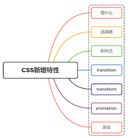

# CSS3 新增特性

## 1. css 是什么

css，即层叠样式表（Cascading Style Sheets）的简称，是一种标记语言，由浏览器解释执行用来使页面变得更美观

css3 是 css 的最新标准，是向后兼容的，CSS1/2 的特性在 CSS3 里都是可以使用的

而 CSS3 也增加了很多新特性，为开发带来了更佳的开发体验

## 2. 选择器



# 3. 新样式

## 1. 边框

css3 新增了三个边框属性，分别是：

- `border-radius`：创建圆角边框

- `box-shadow`：为元素添加阴影

- `border-image`：使用图片来绘制边框

**1. box-radius：圆角** :

通过 border-radius 属性可以给任何元素制作圆角。

- `border-radius:` 所有四个边角`border-*-*-radius` 属性的缩写。
- `border-top-left-radius:` 定义了左上角的弧度。
- `border-top-right-radius:` 定义了右上角的弧度。
- `border-bottom-right-radius:` 定义了右下角的弧度。
- `border-bottom-left-radius:` 定义了左下角的弧度。

```js
<div id="t1"></div>
<style type="text/css">
    #t1{
        height: 100px;
        width: 100px;
        background-color: blue;
        border-radius: 10px;
    }
</style>
```

**2. box-shadow：盒阴影**

设置元素阴影，设置属性如下：

```css
box-shadow: h-shadow v-shadow blur spread color inset;
```

- `h-shadow:` 必需，水平阴影的位置，允许负值。
- `v-shadow:` 必需，垂直阴影的位置，允许负值。
- `blur:` 可选，模糊距离。
- `spread:` 可选，阴影的大小。
- `color:` 可选，阴影的颜色。在 CSS 颜色值寻找颜色值的完整列表。
- `inset:` 可选，从外层的阴影改变阴影内侧阴影。

```js
<div id="t2"></div>
<style type="text/css">
    #t2{
        height: 100px;
        width: 100px;
        border: 1px solid #eee;
        box-shadow: 5px 5px 5px #aaa;
    }
</style>
```

**3. border-image：背景**

CSS3 中包含几个新的背景属性，提供更大背景元素控制。

- `background-image:` 规定背景图片路径。
- `background-clip:` 规定背景的绘制区域。
- `background-origin:` 规定背景图片的定位区域。
- `background-size:` 规定背景图片的尺寸。

```js
<div id="t3"></div>
<style type="text/css">
    #t3{
        height: 100px;
        width: 100px;
        border: 1px solid #eee;
        background-image: url(https://blog.touchczy.top/favicon.ico);
        background-size:30px 30px;
        background-repeat:repeat;
        background-origin:content-box;
    }
</style>
```

## 2. 渐变

CSS3 渐变可以在两个或多个指定的颜色之间显示平稳的过渡。

- `Linear Gradients: `线性渐变，向下/向上/向左/向右/对角方向。
- `Radial Gradients: `径向渐变，由中心定义。

```js
<div id="t4"></div>
<style type="text/css">
    #t4{
        height: 100px;
        width: 100px;
        border: 1px solid #eee;
        background-image: linear-gradient(to right, red , yellow);
    }
</style>
```

## 3. 背景

新增了几个关于背景的属性，分别是 background-clip、background-origin、background-size 和 background-break

## 4. 文字

`word-wrap`:

语法：`word-wrap: normal|break-word`

- normal：使用浏览器默认的换行
- break-all：允许在单词内换行

`text-overflow`:

text-overflow 设置或检索当当前行超过指定容器的边界时如何显示，属性有两个值选择：

- clip：修剪文本
- ellipsis：显示省略符号来代表被修剪的文本

`text-shadow`:

text-shadow 可向文本应用阴影。能够规定水平阴影、垂直阴影、模糊距离，以及阴影的颜色

`text-decoration`:

CSS3 里面开始支持对文字的更深层次的渲染，具体有三个属性可供设置：

- text-fill-color: 设置文字内部填充颜色

- text-stroke-color: 设置文字边界填充颜色

- text-stroke-width: 设置文字边界宽度

```js
<div id="t5">Text</div>
<style type="text/css">
    #t5{
        height: 100px;
        width: 100px;
        border: 1px solid #eee;
        color: #fff;
        text-shadow: -1px 3px 5px #333;
    }
</style>
```

## 5. 颜色

css3 新增了新的颜色表示方式 rgba 与 hsla

- rgba 分为两部分，rgb 为颜色值，a 为透明度
- hala 分为四部分，h 为色相，s 为饱和度，l 为亮度，a 为透明度

## 6. transition 过渡

transition 属性可以被指定为一个或多个 CSS 属性的过渡效果，多个属性之间用逗号进行分隔，必须规定两项内容：

- 过度效果
- 持续时间

语法如下：

```js
transition： CSS属性，花费时间，效果曲线(默认ease)，延迟时间(默认0)
```

上面为简写模式，也可以分开写各个属性

```js
transition-property: width;
transition-duration: 1s;
transition-timing-function: linear;
transition-delay: 2s;
```

```js
<div id="t10"></div>
<style type="text/css">
    #t10{
        height: 100px;
        width: 100px;
        border: 1px solid #eee;
        background: red;
        transition: all .5s;
    }
    #t10:hover{
        height: 100px;
        width: 100px;
        border: 1px solid #eee;
        background: yellow;
        transition: all .5s;
    }
</style>
```

## 7. transform 转换

transform 属性允许你旋转，缩放，倾斜或平移给定元素

`transform-origin：`转换元素的位置（围绕那个点进行转换），默认值为(x,y,z):(50%,50%,0)

使用方式：

- transform: translate(120px, 50%)：位移
- transform: scale(2, 0.5)：缩放
- transform: rotate(0.5turn)：旋转
- transform: skew(30deg, 20deg)：倾斜

```js
<div id="t7"></div>
<style type="text/css">
    #t7{
        height: 100px;
        width: 100px;
        border: 1px solid #eee;
        transform:rotate(10deg);
    }
</style>
```

## 8. animation 动画

动画这个平常用的也很多，主要是做一个预设的动画。和一些页面交互的动画效果，结果和过渡应该一样，让页面不会那么生硬

animation 也有很多的属性

- animation-name：动画名称
- animation-duration：动画持续时间
- animation-timing-function：动画时间函数
- animation-delay：动画延迟时间
- animation-iteration-count：动画执行次数，可以设置为一个整数，也可以设置为 infinite，意思是无限循环
- animation-direction：动画执行方向
- animation-paly-state：动画播放状态
- animation-fill-mode：动画填充模式

```js
<div id="t9"></div>
<style type="text/css">
    @keyframes animation{
        from {background:red;}
        to {background:yellow;}
    }
    #t9{
        height: 100px;
        width: 100px;
        border: 1px solid #eee;
        animation:animation 5s ease infinite alternate;
    }
</style>
```
