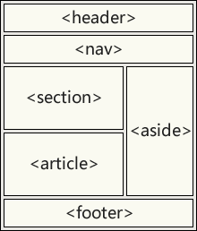

# HTML5 新特性

## 新增内容

1.语义化标签

2.增强型表单包括属性以及元素

3.新增视频`<video>`和音频`<audio>`标签

4.Canvas 图形

5.地理定位

6.拖放 API

7.SVG 绘图

8.Web Worker

9.Web Storage

10.Web Socket

## 1. 新增的语义化标签

- `<header>`：头部标签
- `<nav>`：导航标签
- `<article>`：内容标签
- `<section>`：定义文档某个区域
- `<aside>`：侧边栏标签
- `<footer>`：尾部标签

- `<details>`：定义用户可以看到或者隐藏的额外细节
- ` <summary>`：标签包含 details 元素的标题
- `<dialog>`：定义对话框
- `<figure>`: 定义自包含内容，如图表
- `<main>`: 定义文档主内容
- `<mark>`: 定义文档的主内容
- `<time>`: 定义日期/时间



注意：

1. 这种语义化标准主要是针对`搜索引擎`的
2. 这些新标签页面中可以使用`多次`
3. 在 IE9 中，需要把这些元素转换为`块级元素`
4. 其实，`移动端`更喜欢使用这些标签

## 2. 增强型表单

- html5 修改一些新的 `input 输入特性`，改善更好的输入控制和验证

| 输入类型       | 描述                     |
| -------------- | ------------------------ |
| color          | 主要用于选取颜色         |
| date           | 选取日期                 |
| datetime       | 选取日期(UTC 时间)       |
| datetime-local | 选取日期（无时区）       |
| month          | 选择一个月份             |
| week           | 选择周和年               |
| time           | 选择一个时间             |
| email          | 包含 e-mail 地址的输入域 |
| number         | 数值的输入域             |
| url            | url 地址的输入域         |
| tel            | 定义输入电话号码和字段   |
| search         | 用于搜索域               |
| range          | 一个范围内数字值的输入域 |

- html5 新增了五个`表单元素`

| 标签          | 描述                                           |
| ------------- | ---------------------------------------------- |
| `<datalist> ` | 用户会在他们输入数据时看到域定义选项的下拉列表 |
| `<progress>`  | 进度条，展示连接/下载进度                      |
| `<meter>`     | 选刻度值，用于某些计量，例如温度、重量等       |
| `<keygen>`    | 提供一种验证用户的可靠方；生成一个公钥和私钥   |
| `<output>`    | 用于不同类型的输出，比如尖酸或脚本输出         |

- html5 新增`表单属性`

| 属性         | 描述                                      |
| ------------ | ----------------------------------------- |
| placehoder   | 输入框默认提示文字                        |
| required     | 要求输入的内容是否可为空                  |
| pattern      | 描述一个正则表达式验证输入的值            |
| min/max      | 设置元素最小/最大值                       |
| step         | 为输入域规定合法的数字间隔                |
| height/wdith | 用于 image 类型`<input>`标签图像高度/宽度 |
| autofocus    | 规定在页面加载时，域自动获得焦点          |
| multiple     | 规定`<input>`元素中可选择多个值           |

## 3. 音频和视频

1. html5 提供了音频和视频文件的标准，既使用`<audio>`元素。

- 音频：`<audio src=" "></audio>`

```js
<audio controls>    //controls属性提供添加播放、暂停和音量控件。
  <source src="horse.ogg" type="audio/ogg">
  <source src="horse.mp3" type="audio/mpeg">
您的浏览器不支持 audio 元素。        //浏览器不支持时显示文字
</audio>
```

2. 视频：`<video src=" "></video>`

```js
<video width="320" height="240" controls>
  <source src="movie.mp4" type="video/mp4">
  <source src="movie.ogg" type="video/ogg">
您的浏览器不支持Video标签。
</video>
```

## 4. Canvas 绘图

​`<canvas>` 是 HTML5 新增的，一个可以使用脚本(通常为 JavaScript) 在其中绘制图像的 HTML 元素。它可以用来`制作照片集或者制作简单(也不是那么简单)的动画`，甚至可以`进行实时视频处理和渲染`。

​ 它最初由苹果内部使用自己 MacOS X WebKit 推出，供应用程序使用像仪表盘的构件和 Safari 浏览器使用。后来，有人通过 Gecko 内核的浏览器 (尤其是 Mozilla 和 Firefox)，Opera 和 Chrome 和超文本网络应用技术工作组建议为下一代的网络技术使用该元素。

`​Canvas 是由 HTML 代码配合高度和宽度属性而定义出的可绘制区域`。JavaScript 代码可以访问该区域，类似于其他通用的二维 API，通过一套完整的绘图函数来动态生成图形。

https://www.runoob.com/w3cnote/html5-canvas-intro.html

1. 基本使用：

```js
<canvas id="tutorial" width="300" height="300"></canvas>
```

2. `<canvas>` 元素

​`<canvas>` 看起来和 `` 标签一样，只是 `<canvas>` 只有两个可选的属性 width、heigth 属性，而没有 src、alt 属性。

​ 如果不给 `<canvas>` 设置 widht、height 属性时，则默认 width 为 300、height 为 150，单位都是 px。也可以使用 css 属性来设置宽高，但是如宽高属性和初始比例不一致，他会出现扭曲。所以，建议永远不要使用 css 属性来设置 `<canvas>` 的宽高。

..............

## 5. SVG 绘图

- `什么是 SVG?`

  - SVG 指可伸缩矢量图形

  - SVG 用于定义用于网络的基于矢量的图形

  - SVG 使用 XML 格式定义图形

  - SVG 图像在放大或改变尺寸的情况下其图形质量不会有损失

  - SVG 是万维网联盟的标准

- `SVG 的优势`

  - SVG 图像可通过文本编译器来创建和修改

  - SVG 图像可被搜索、索引、脚本化或压缩

  - SVG 是可伸缩的

  - SVG 图像可在任何的分辨率下被高质量的打印

  - SVG 可在图像质量不下降的情况下被放大

- `SVG 与 Canvas 区别`

  - \*SVG 适用于描述 XML 中的 2D 图形的语言

  - \*Canvas 随时随地绘制 2D 图形（使用 javaScript）

  - \*SVG 是基于 XML 的，意味这可以操作 DOM，渲染速度较慢

  - \*在 SVG 中每个形状都被当做是一个对象，如果 SVG 发生改变，页面就会发生重绘

  - \*Canvas 是一像素一像素地渲染，如果改变某一个位置，整个画布会重绘。

| Canvas                             | SVG                        |
| ---------------------------------- | -------------------------- |
| 依赖分辨率                         | 不依赖分辨率               |
| 不支持事件处理器                   | 支持事件处理器             |
| 能够以.png 或.jpg 格式保存结果图像 | 复杂度会减慢搞渲染速度     |
| 文字呈现功能比较简单               | 适合大型渲染区域的应用程序 |
| 最合适图像密集的游戏               | 不适合游戏应用             |

## 6. 地理定位

使用 getCurrentPosition()方法来获取用户的位置。以实现“LBS 服务”

```js
<script>
var x=document.getElementById("demo");
function getLocation()
  {
  if (navigator.geolocation)
    {
    navigator.geolocation.getCurrentPosition(showPosition);
    }
  else{x.innerHTML="Geolocation is not supported by this browser.";}
  }
function showPosition(position)
  {
  x.innerHTML="Latitude: " + position.coords.latitude +
  "<br />Longitude: " + position.coords.longitude;
  }
</script>
```

## 7. 拖放 API

拖放是一种常见的特性，即`捉取对象以后拖到另一个位置。`

在 html5 中，拖放是标准的一部分，任何元素都能够拖放。

```js
<div draggable="true"></div>
```

当元素拖动时，我们可以检查其拖动的数据

```js
<div draggable="true" ondragstart="drag(event)"></div>
<script>
function drap(ev){
    console.log(ev);
}
</script>
```

| 拖动生命周期 | 属性名      | 描述                                           |
| ------------ | ----------- | ---------------------------------------------- |
| 拖动开始     | ondragstart | 在拖动操作开始时执行脚本                       |
| 拖动过程中   | ondrag      | 只要脚本在被拖动就运行脚本                     |
| 拖动过程中   | ondragenter | 当元素被拖动到一个合法的防止目标时，执行脚本   |
| 拖动过程中   | ondragover  | 只要元素正在合法的防止目标上拖动时，就执行脚本 |
| 拖动过程中   | ondragleave | 当元素离开合法的防止目标时                     |
| 拖动结束     | ondrop      | 将被拖动元素放在目标元素内时运行脚本           |
| 拖动结束     | ondragend   | 在拖动操作结束时运行脚本                       |

## 8. Web Worker

Web Worker 可以`通过加载一个脚本文件，进而创建一个独立工作的线程，在主线程之外运行`。

**基本使用：**

Web Worker 的基本原理就是在当前 javascript 的主线程中，使用 Worker 类加载一个 javascript 文件来开辟一个新的线程，起到互不阻塞执行的效果，并且提供主线程和新线程之间数据交换的接口：`postMessage、onmessage`。

- javascript:

```js
//worker.js
onmessage = function (evt) {
  var d = evt.data; //通过evt.data获得发送来的数据
  postMessage(d); //将获取到的数据发送会主线程
};
```

- html

```html
<!DOCTYPE html>
<html>
  <head>
    <meta http-equiv="Content-Type" content="text/html; charset=utf-8" />
    <script type="text/javascript">
      //WEB页主线程
      var worker = new Worker("worker.js"); //创建一个Worker对象并向它传递将在新线程中执行的脚本的URL
      worker.postMessage("hello world"); //向worker发送数据
      worker.onmessage = function (evt) {
        //接收worker传过来的数据函数
        console.log(evt.data); //输出worker发送来的数据
      };
    </script>
  </head>
  <body></body>
</html>
```

## 9. Web Storage

WebStorage 是 HTML 新增的`本地存储解决方案之一`，但`并不是取代cookie而指定的标准`，cookie 作为 HTTP 协议的一部分用来处理客户端和服务器的通信是不可或缺的，session 正式依赖与实现的客户端状态保持。

`WebSorage的意图在于解决本来不应该cookie做，却不得不用cookie的本地存储`。

websorage 拥有 5M 的存储容量，而 cookie 却只有 4K，这是完全不能比的。

客户端存储数据有两个对象，其用法基本是一致。

`localStorage：`没有时间限制的数据存储

`sessionStorage:` 在浏览器关闭的时候就会清除。

```js
localStorage.setItem(key, value); //保存数据
let value = localStorage.getItem(key); //读取数据
localStorage.removeItem(key); //删除单个数据
localStorage.clear(); //删除所有数据
let key = localStorage.key(index); //得到某个索引的值
```

## 10. WebSocket

WebSocket 协议`为 web 应用程序客户端和服务端之间提供了一种全双工通信机制`。

**特点：**

（1）握手阶段采用 HTTP 协议，默认端口是 80 和 443

（2）建立在 TCP 协议基础之上，和 http 协议同属于应用层

（3）可以发送文本，也可以发送二进制数据。

（4）没有同源限制，客户端可以与任意服务器通信。

（5）协议标识符是 ws（如果加密，为 wss），如 ws://localhost:8023
