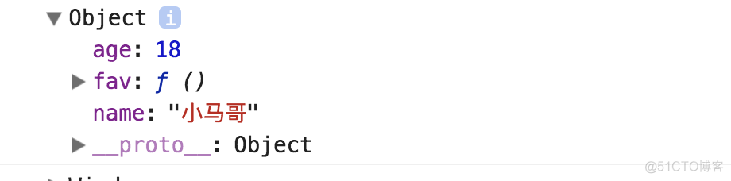
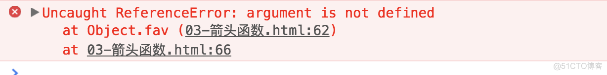

# 箭头函数

## 基本用法

ES6 中允许使用箭头 => 定义函数

```js
var f = (v) => v;
```

等同于

```js
var f = function (v) {
  return v;
};
```

`根据箭头函数有无参数来区分`：

1. 无参数的函数箭头

```js
var f = () => 5;
```

等同于

```js
var f = function () {
  return 5;
};
```

2. 有参数的箭头函数

```js
var sum = (a, b) => a + b;
```

等同于

```js
var sum = function (a, b) {
  return a + b;
};
```

- 有的函数体内的语句大于一条的话，它的写法如下 使用一个大括号将其括起来，并使用 return 语句返回

```js
var sum = (a, b) => {
  return a + b;
};
```

- 由于大括号被解释为代码块，所有如果箭头函数直接返回一个对象时，必须在对象外面加一个大括号

```js
var getFunction = (id) => ({ id: id, name: "Temp" });
```

- 箭头函数也可以与变量结构结合使用

```js
const full = ({ first, last }) => first + " " + last;
```

等同于

```js
function full(person) {
  return person.first + " " + person.last;
}
```

使用箭头函数可以让函数表达的更加简洁

箭头函数的一个用处是：简化回调函数

```js
[1, 2, 3].map(function (x) {
  return xx;
});
```

使用箭头函数的写法：

```js
[1, 2, 3].map((x) => xx);
```

另一个例子：

```js
var result = values.sort(function (a, b) {
  return a - b;
});
```

箭头函数的写法：

```js
var result = values.sort((a, b) => a - b);
```

- `使用 rest 参数与箭头函数结合的例子：`

```js
const numbers = (...nums) => nums;

numbers(1, 2, 3, 4, 5, 6, 7, 8, 9);//[1, 2, 3, 4, 5, 6, 7, 8, 9]

//...nums 表示的是一个数组

const headAndTail = ( head, ...tail ) => [head, tail]；

headAndTail(1,2,3,4,5,6,7,8,9);// [1, [2,3,4,5,6,7,8,9]]
```

## `使用箭头函数的注意点：`

- **函数体内的 this 对象就是定义时所在的对象，而不是使用时所在对象**

```js
1  var name = '张三'；
 2  var person = {
 3         name:'小马哥',
           age:18,　　
 4         fav:function(){
 5             console.log(this)
 6             console.log(this.name)
 7         }
 8     }
 9
10     person.fav();
```

打印结果：



此时 this 指向的是使用它的对象，也就是 person 对象。

```js
var person2 = {
  name: "小马哥",
  age: 18,
  fav: () => {
    // 当前this指向了定义时所在的对象（window）
    console.log(this);
  },
};

person2.fav();
```

打印结果为 Window。

使用箭头函数，他表示定义时所在的对象 window。

再一个例子：

```js
function foo() {
  setTimeout(() => {
    console.log("id:", this.id);
  }, 100);
}

var id = 21;

foo.call({ id: 42 });
// id: 42
```

上面代码中，​​setTimeout​​​ 的参数是一个箭头函数，这个箭头函数的定义生效是在 ​​foo​​​ 函数生成时，而它的真正执行要等到 100 毫秒后。如果是普通函数，执行时 ​​this​​​ 应该指向全局对象 ​​window​​​，这时应该输出 ​​21​​​。但是，箭头函数导致 ​​this​​​ 总是指向函数定义生效时所在的对象（本例是 ​​{id: 42}​​​），所以输出的是 ​​42​​。

- **不可以当做构造函数使用，也就是不能用 new 命令实例化一个对象，否则会抛出一个错误**

- **不可以使用 arguments 对象，该对象在函数体内不存在，如果要用的话，可以用 rest 参数代替**

```js
var person3 = {
  name: "小马哥",
  age: 18,
  fav: () => {
    console.log(argument);
  },
};

person3.fav("把妹", "把爷");
```



- **不可以使用 yield 命令，箭头函数不能用作 Generator 函数**
