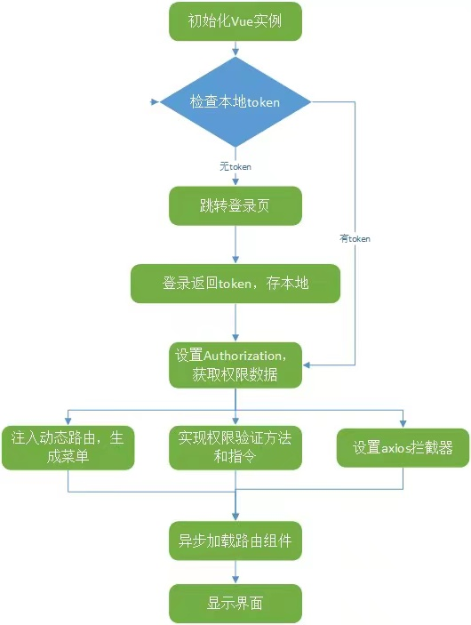
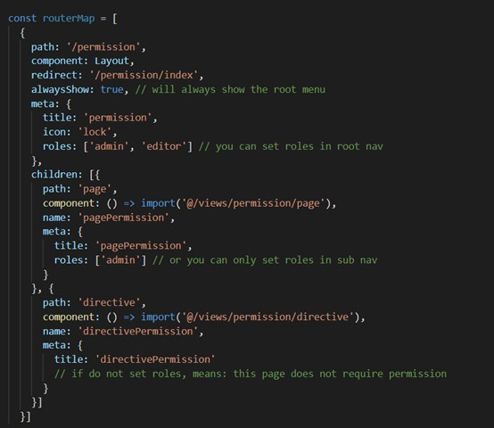

# vue 权限管理的实现方法

1. `权限管理是什么`

   权限是对特定资源的访问许可，所谓权限控制，也就是确保用户只能访问到被分配的资源。 而前端权限归根结底是请求的发起权，请求的发起可能有下面两种形式触发：

a、页面加载触发;

b、页面上的按钮点击触发。

对触发权限的源头进行控制：

1）路由方面，用户登录后只能看到自己有权访问的导航菜单，也只能访问自己有权访问的路由地址，否则将跳转 4xx 提示页。

2）视图方面，用户只能看到自己有权浏览的内容和有权操作的控件。

## 权限管理实现流程图



2. `如何进行权限控制`

**前端权限控制可以分为三个方面：**

- 接口权限

接口权限目前一般采用` jwt 的形式来验证`，没有通过的话一般返回 401，跳转到登录页面重新进行登录。

登录完拿到 token，将 token 存起来（将 token 存贮到 cookie 中，保证刷新页面后仍能记住用户登录状态），通过 axios 请求拦截器进行拦截，每次请求的时候头部携带 token。

参考代码如下：

```js
// http request 拦截器
service.interceptors.request.use(
  (config) => {
    // 进度条开始
    NProgress.start();
    // 如果 store 存在 token
    // console.log('http: ' + store.state.account.token);
    if (store.state.account.token) {
      // 则在头部 Authorization 字段添加 Bearer Token
      config.headers.Authorization = "Bearer " + store.state.account.token;
    } else if (localStorage.getItem(constant.token)) {
      // 解决刷新 token 丢掉问题
      store.commit("account/addToken", localStorage.getItem(constant.token));
      // 则在头部 Authorization 字段添加 Bearer Token
      config.headers.Authorization = "Bearer " + store.state.account.token;
    }
    // 带上语言参数
    config.headers.common["Accept-Language"] = i18n.locale;
    return config;
  },
  (err) => {
    // 进度条结束
    NProgress.done();
    // for debug
    console.log(err);
    return Promise.reject(err);
  }
);
```

```js
// http response 拦截器
service.interceptors.response.use(
  (response) => {
    // 进度条结束
    NProgress.done();
    return response.data;
  },
  (error) => {
    // 进度条结束
    NProgress.done();
    if (error.response) {
      switch (error.response.status) {
        case 401:
          // 返回 401 代表授权错误，清楚 token 并跳转到登录页面
          Message.success("授权错误，请重新登录");
          // store.commit('account/removeToken');
          router.push("/login");
          break;
        default:
          Message.error(error.response.data.message || "操作出错了");
          console.log(error.response);
          break;
      }
    }
    return Promise.reject(error);
  }
);
```

<hr>

- 路由权限

方案一 ：初始化即挂载全部路由，并且在路由上标记相应的权限信息，每次路由跳转前做校验。 参考代码示例如下：



缺点：

a、加载所有的路由，如果路由很多，而用户并不是所有的路由都有权限访问，对性能会有影响。

b、全局路由守卫里，每次路由跳转都要做权限判断。

c、菜单信息写死在前端，要改个显示文字或权限信息，需要重新编译。

d、菜单跟路由耦合在一起，定义路由的时候还有添加菜单显示标题，图标之类的信息，而且路由不一定作为菜单显示，还要多加字段进行标识。

方案二：

初始化的时候先挂载不需要权限控制的路由，比如登录页，404 等错误页。 如果用户通过 URL 进行强制访问，则会直接进入 404，相当于从源头上做了控制。

登录后，获取用户的权限信息，然后筛选有权限访问的路由，在全局路由守卫里进行调用 addRoutes 添加路由。

按需挂载，路由就需要知道用户的路由权限，也就是在用户登录进来的时候就要知道当前用户拥有哪些路由权限。

参考代码如下：

```js
router.beforeEach(async(to, \_from, next) => {
   // 设置页面标题
   document.title = getPageTitle(to.meta.title);
   const hasToken = getToken();
   // 取得 模块 String
   const module = String(to.path).split('/')[1];
   switch (module) {
      case 'admin': // 后台模块
      // 判断有无 token
      // 存在 token
      if (hasToken) {
         if (to.path === '/admin/login') {
           // 如果已经登录则重定向到首页
           next({ path: '/admin/home' });
         } else {
           // 获取用户信息，判断用户角色
           const hasRoles = store.state.user.userInfo.roles && store.getters.userInfoLength > 0;
           if (hasRoles) {
              // 如果在挂载的路由中匹配不到该路由
              if (to.matched.length === 0) {
                  // 存在该路由则跳转到 401 权限不足页面
                  next('/page-401');
              } else {
                next();
                }
              } else {
                  try {
                      // 获取用户信息
                      const { roles } = await store.dispatch('getUserInfo');
                      // 加载后端返回的有权限访问的路由
                      const accessedRouters = await store.dispatch('generateRoutes', roles);
                      // 添加可访问路由表
                      router.addRoutes(accessedRouters);

                     // addRoutes 可能还没完全 add 好导致下面 next 失效，使用 next(to) 让代码 重新进入 router.beforeEach 这个钩子，再通过 next() 来释放钩子，确保所有的路由都已经挂载完成
                     // hack 方法，确保 addRoutes 已完成，set the replace: true
                     next({ ...to, replace: true });
                } catch (err) {
                   // 调用登出方法，并且跳转到登录页面
                   store.commit('LOGOUT');
                   next(`/admin/login?redirect=${to.path}`);
                  }
                }
           }
           } else { // 没有 token
              // 如果跳转页面在白名单里面，直接跳转
              if (whiteList.indexOf(to.path) !== -1) {
                   next();
              } else {
                 // 不在白名单内的页面则跳转到登录页面，且拼接跳转路径
                 next(`/admin/login?redirect=${to.path}`);
                }
            }
            break;
            default:
// console.log('其它模块 store: ' + store.state.user_aos.token);
// console.log('其它模块 localStorage: ' + localStorage.getItem(constant.token));
// 其它模块
if (localStorage.getItem(constant.token)) {
      next();
} else {
// 如果跳转页面在白名单里面，直接跳转
       if (whiteList.indexOf(to.path) !== -1) {
           next();
} else {
// 不在白名单内的页面则跳转到登录页面，且拼接跳转路径
     console.log('没有权限');
     next('/login');
  }
}
   next();
   break;
}
});
```

3. 菜单权限

每次路由跳转的时候都要判断权限，这里的判断也很简单，因为菜单的 name 与路由的 name 是一一对应的，而后端返回的菜单就已经是经过权限过滤的，如果根据路由 name 找不到对应的菜单，就表示用户有没权限访问；如果路由很多，可以在应用初始化的时候，只挂载不需要权限控制的路由。取得后端返回的菜单后，根据菜单与路由的对应关系，筛选出可访问的路由，通过 addRoutes 动态挂载。

参考代码如下：

```js
// 过滤后端返回的路由导航配置
// @param {_} routerlist
  function filterReturnRoutes(routerlist) {
  routerlist.forEach(e => {
  // 删除无用属性
  delete e.id;
  delete e.pid;
  delete e.description;
  delete e.created_at;
  delete e.role;
  delete e.pivot;
  delete e.sort;
  delete e.role_name;
  delete e.status;
  e.component = \_import(e.component); // 动态匹配组件
  if (e.redirect === '') {
      delete e.redirect;
  }
  if (e.children != null) {
      // 存在子路由就递归
      filterReturnRoutes(e.children);
    }
  });
  return routerlist;
}

const permisstionStore = {
  state: {
    routers: constantRouterMap,
    addRouters: [],
    navRouters: []
  },
  mutations: {
     SET_ROUTES: (state, routers) => {
        state.addRouters = routers;
        if (state.routers.indexOf(routers) === -1) {
            state.routers = constantRouterMap.concat(routers);
        }
     },
     // 保存后端返回的路由表
     SET_RETURN_ROUTES: (state, routers) => {
     state.navRouters = routers.navRoutes; // 左侧导航栏
     if (state.routers.indexOf(routers) === -1) {
     state.routers = constantRouterMap.concat(routers.asyncRouterMap);
     }
    }
  },
  actions: {
    generateRoutes({ commit }, routers) {
      return new Promise(resolve => {
        const accessedRoutes = filterReturnRoutes(routers.list);
        asyncRouterMap[0].children = accessedRoutes;
        const routeObject = {
          'asyncRouterMap': asyncRouterMap,
          'navRoutes': routers.tree
        };
        commit('SET_RETURN_ROUTES', routeObject);
        resolve(asyncRouterMap);
      });
    }
  }
};+
```
