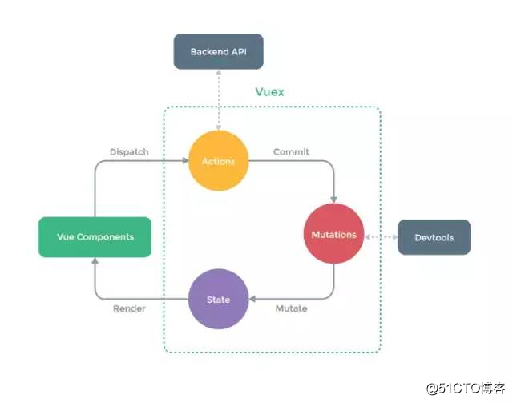
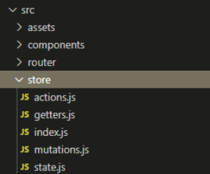

# Vuex

## 1. vuex 概述

### 1.1 组件之间数据共享的方式（小范围）

- 父向子传值：v-bind 属性绑定

- 子向父传值：v-on 事件绑定

- 兄弟之间共享数据： EventBus
  - $on 接收数据的那个组件
  - $emit 发送数据的那个组件

### 1.2 vuex 是什么

Vuex 是实现组件全局状态（数据）管理的一种机制，可以方便的实现组件之间数据的共享。

### 1.3 使用 vuex 统一管理的好处

1. 能够在 vuex 中集中管理共享的数据，易于开发和后期维护

2. 能够高效的实现组件之间的数据共享，提高开发效率
3. 存储在 vuex 中的数据都是响应式的，能实时保持数据与页面的同步
4. 一般情况下，只有组件之间共享的数据，才有必要存储到 vuex 中；对于组件中的私有数据，依旧存储在组件自身的 data 中即可

## 2. Vuex 的基本使用

- 1.安装 Vuex 依赖包

```
npm install vuex --save
```

- 2 导入 vuex 包

```js
import Vuex from "vuex";
Vue.use(Vuex);
```

- 3.创建 store 对象

```js
const store = new Vuex.Store({
  // state 中存放的就是全局共享的数据
  state: { count: 0 },
});
```

- 4.将 store 对象挂载到 vue 实例中

```js
new Vue({
  el: "#app",
  render: (h) => h(app),
  router,
  // 将创建的共享数据对象，挂载到vue实例中
  // 所有的组件，就可以直接从store中获取全局的数据了
  store,
});
```

## 3. Vuex 的核心概念

### 3.1 核心概念概述

- State
  - vuex 的基本数据，用来存储变量
- Mutation
  - 提交更新数据的方法，必须是同步的。每各 mutation 都有一个字符串的 事件类型 type 和一个回调函数 handler。回调函数就是实际进行状态更改的地方，并且它会接受一个 state 作为第一个参数，提交何在作为第二个参数
- Action
  - 可以包含任意异步操作，提交的是 mutation，而不是直接变更状态
- Getter
  - 从基本数据（state）派生的数据，相当于 state 的计算属性
- modules
  - 模块化的 vuex，可以让每一个模块拥有自己的 state、mutation、action、getters，让结构清晰，方便管理

### `1. State`

state `提供唯一的公共数据源`，所有共享的数据都要统一放到 store 的 state 中进行存储。

```js
// 创建store数据源，提供唯一公共数据
const store = new Vuex.Store({
  state: {
    count: 0,
  },
});
```

- 组件访问 state 中数据的 第一种 方式：

```js
this.$store.state.全局数据名称;
```

- 组件访问 state 中数据的 第二种 方式：

```js
// 1. 从vuex中按需导入mapState函数
import { mapState } from "vuex";

// 通过刚才导入的mapState函数，将当前组件需要的全局数据，映射为当前组件的computed计算属性：

// 2. 将全局数据，映射为当前组件的计算属性
computed: {
  ...mapState(["count"]);
}
```

**`1.1 mapState辅助函数`**

当一个组件需要获取多个状态时候，将这些状态都声明为计算属性会有些重复和冗余。为了解决这个问题，我们可以使用 mapState 辅助函数帮助我们生成计算属性，让你少按几次键。

```js
// 在单独构建的版本中辅助函数为 Vuex.mapState
import { mapState } from "vuex";

export default {
  // ...
  computed: mapState({
    // 箭头函数可使代码更简练
    count: (state) => state.count,

    // 传字符串参数 'count' 等同于 `state => state.count`
    countAlias: "count",

    // 为了能够使用 `this` 获取局部状态，必须使用常规函数
    countPlusLocalState(state) {
      return state.count + this.localCount;
    },
  }),
};
```

### `2. Mutation`

mutation 用于`变更 store 中的数据`。

- 只能通过 mutation 变更 store 数据，`不可以直接操作 store 中的数据`

- 通过这种方式虽然操作起来稍微繁琐一些，但是可以集中监看所有数的变化

1. 触发 mutations 的 第一种 方式

```js
// 定义Mutation
const store = new Vuex.Store({
  state: {
    count: 0,
  },
  mutations: {
    add(state) {
      // 变更状态
      state.count++;
    },
  },
});
```

组件中访问 mutations

```js
// 触发mutation
methods: {
  handle1() {
    // 触发mutations的第一种方式
    this.$store.commit('add')
  }
}
```

- 可以在触发 mutations 时传递参数：

```js
// 定义mutation
const store = new Vuex.State({
  state: {
    count: 0,
  },
  mutations: {
    addN(state, step) {
      //变更状态
      state.count += step;
    },
  },
});
```

```js
methods: {
  handle2() {
    // 在调用 commit 函数，
    // 触发 mutations 时携带参数
    this.$store.commit('addN'， 3)
  }
}
```

2. 触发 mutations 的 第二种 方式

```js
//1. 从vuex中按需导入mapMutations 函数
import { mapMutations } from "vuex";
```

通过刚才导入的 mapMutations 函数，将需要的 mutations 函数映射为当前`组件`的 methods 方法：

```js
// 2.将指定的mutations 函数，映射为当前组件中的methods函数
methods: {
  ...mapMutations (['add', 'addN'])
}
```

- mutation 中不能执行异步操作代码

### `3.Action `

action 用于`处理异步任务`。

如果通过异步操作变更数据，必须通过 action，而不能用 mutation，但是在 action 中还是要通过触发 mutation 的方式间接变更数据。

```js
// 定义Action
const store = new Vuex.Store({
  // ...省略其他代码
  mutations: {
    add(state) {
      state.count++;
    },
  },
  actions: {
    addAsync(context) {
      setTimeout(() => {
        context.commit("add");
      }, 1000);
    },
  },
});
```

1. 触发 actions 的第一种方式

```js
// 触发Action
methods: {
  handle() {
    //触发actions的第一种方式
    this.$store.dispatch('addAsync')
  }
}
```

- 只有 mutations 中定义的函数，才有权利修改 state 中的数据

- 在 actions 中，不能直接修改 state 中的数据，必须通过 context.commit() 触发某个 mutation 才可以

2. 触发 actions 的第二种方式：`触发异步任务时携带参数`

```js
// 定义Action
const store = new Vuex.Store({
  // ...省略其他代码
  mutations: {
    addN(state, step) {
      state.count += step;
    }, // mutations 是第四步
  },
  actions: {
    addAsync(context, step) {
      // step 是第二步
      setTimeout(() => {
        context.commit("addN", step); // ("addN", step)是第三步
      }, 1000);
    },
  },
});
```

```js
// 触发Action
methods: {
  handle() {
    //在调用dispatch函数
    // 触发actions时携带参数
    this.$store.dispatch('addAsync'， 5)// 5是第一步
  }
}
```

2. this.$store.dispatch() 是 actions 的第一种方式，触发 Actions 的第二种方式：

```js
// 1. 从 vuex 中按需导入 mapActions 函数
import { mapActions } from "vuex";
```

通过刚才指定 actions 函数，将需要的 actions 函数，映射为当前组件的 methods 方法：

```js
// 2. 将指定的 actions 函数， 映射为当前组件的 methods 函数
methods: {
  ...mapActions(['addAsync', 'addNAsync'])
}
```

### `4.Getter`

Getter 用于对 store 中的数据进行`加工处理形成新的数据`。（包装数据）

1. Getter 可以对 store 中已有的数据加工处理之后形成新的数据，类似 vue 的计算属性。
2. store 中的数据发生变化，Getter 的数据也会跟着变化。

Vuex 允许我们在 store 中定义“getter”（可以认为是 store 的计算属性）。就像计算属性一样，`getter 的返回值会根据它的依赖被缓存起来，且只有当它的依赖值发生了改变才会被重新计算`。
getters 接收 state 作为其第一个参数，接受其他 getters 作为第二个参数，如不需要，第二个参数可以省略

```js
// 定义Getter
const store = new Vuex.Store({
  state: {
    count: 0,
  },
  getters: {
    showNum: (state) => {
      return "当前最新的数量是【" + state.count + "】";
    },
  },
});
```

- 使用 getters 的第一种方式：

```js
this.$store.getters.名称;
```

- 使用 getters 的第二种方式：

```js
import { mapGetters } from 'vuex'

computed: {
  ...mapGetters(['showNu'])
}
```

mapGetters 辅助函数 `仅仅是将 store 中的 getter 映射到局部计算属性`

### `5.Module`

使单一状态树，导致应用的所有状态集中到一个很大的对象，但是，当应用变得很大时，store 对象会变得臃肿不堪。

为了解决以上问题，vuex 允许将 store 分割到模块（module）。每个模块拥有自己的 state、mutation、action、getters，甚至是嵌套子模块----从上到下进行类似的分割：

```js
import Vuex from "vuex";
import topNav_store from "./topNav/store.js";
import member_store from "./member/store.js";
import game_store from "./coupon/game.js";
import approval from "./approval/store.js";
import setRentInfo from "./contract/store.js";
export default new Vuex.Store({
  modules: {
    topNav: topNav_store,
    memberStore: member_store,
    game_store: game_store,
    approval: approval,
    setRentInfo,
  },
});
```

- `1.mapState 和 mapGetters 在组件中都是写在 computed 里面`

- `2.mapMutations 和 mapActions 在组件中都是写在 methods 里面`
- `store 中的所有属性，都可以拆分成单独的js文件来书写`
- 使用下面这两种方法存储数据：
  - `dispatch`：异步操作，写法： this.$store.dispatch('mutations 方法名',值)
  - `commit`：同步操作，写法：this.$store.commit('mutations 方法名',值)

<hr>

# 详细教程

## 1. 简介

vuex 是专门用来管理 vue.js 应用程序中状态的一个插件。他的作用是`将应用中的所有状态都放在一起`，`集中式来管理`。

需要声明的是，这里所说的状态指的是 vue 组件中 data 里面的属性。

## 2. vuex 组成结构示意图



**`vuex 的特点`**：

- 把数据单独隔离，形成一棵树状图。
- 单独隔离就意味着它有自己的生态系统。
- 输入和输出，其中 action 作为数据的输入，state 作为数据的输出。

`!!! 只能在mutaions里修改state，actions不能直接修改state`

**mutations :**

- 修改 state 的数据，而且只能是同步的，不能存在异步的操作。
- 如果需要异步怎么办呢？把异步操作放在 actions 里，拿到数据再通过 mutations 同步处理。
- vuex 做的其实是把职权明确了，责任细分了。所以它文档里也说，小系统可以不用。状态数据少，没有细分的必要。

## 3. 安装

```js
// 目前版本 "vuex": "^3.6.0"
npm install --save vuex
```

### vuex 的核心概念

建立以下目录结构：

```xml
/ src
	/ store
		- index.js
		- actions.js
		- mutations.js
		- state.js
		- getters.js
```

如图：



## **`1. store`**

vuex 中`最关键的`是 store 对象，这是 vuex 的核心。可以说，vuex 这个插件其实就是一个 store 对象，每个 vue 应用仅且仅有一个 store 对象。

- 创建 store

```js
// index.js

import Vue from "vue";
import Vuex from "vuex";
import state from "./state.js";
import mutations from "./mutations.js";
import actions from "./actions.js";
import getters from "./getters.js";

Vue.use(Vuex);

export default new Vuex.Store({
  state,
  mutations,
  actions,
  getters,
});
```

- 引入 store

```js
// main.js

import Vue from "vue";
import App from "./App";
import store from "./store";

new Vue({
  el: "#app",
  store,
  render: (h) => h(App),
});
```

## **`2. state`**

state 就是需要管理的状态，即数据。

```js
// state.js

export default {
  name: "dd",
  age: 18,
};
```

```js
// 状态获取
// App.vue

<template>
  <div id="app">
  </div>
</template>

<script>
	export default {
	  name: 'App',
	  mounted() {
		console.log(this.$store.state.name);
	  }
	}
</script>

```

## **`3. getters`**

有时候需要对 state 中的数据进行处理，可以通过 getters 定义对应函数。

```js
// getters.js

export default {
  name(state) {
    return state.name + "tl";
  },
};
```

```js
// App.vue

<template>
  <div id="app">
  </div>
</template>

<script>
	export default {
	  name: 'App',
	  mounted() {
    console.log(this.$store.state.name);
    console.log(this.$store.getters.name);
	  }
	}
</script>
```

## **`4. mutations`**

用来定义数据的更新操作。

```js
// mutations.js

export default {
  addAge(state) {
    state.age += 1;
  },
};
```

```js
// App.vue

<template>
  <div id="app">
  </div>
</template>

<script>
	export default {
	  name: 'App',
	  mounted() {
		console.log(this.$store.state.age);
		// 触发mutations需要用commit
		this.$store.commit('addAge');
		console.log(this.$store.state.age);
	  }
	}
</script>
```

## **`5. actions`**

- 为什么需要异步更新数据？

  - 答：因为数据通常是通过异步的 Ajax 请求获取的

- 为什么不能在 mutations 中定义异步的方法呢？

  - 答：mutations 只能通过 commit 执行，而这个方法没有返回值，因此如果在 mutations 内定义了 Promise 对象我们也取不到。就算这种方案可靠，它也将数据的更新全部定义成了异步方式，当想要同步更新数据时就没办法了

```js
// actions.js

export default {
  addAgeAsync({ commit }) {
    console.log("1");
    return new Promise((resolve, reject) => {
      console.log("2");
      setTimeout(() => {
        console.log("4");
        commit("addAge");
      }, 0);
    });
  },
};
```

```js
// App.vue

<template>
  <div id="app">
  </div>
</template>

<script>
	export default {
	  name: 'App',
	  mounted() {
        console.log(this.$store.state.age)
        console.log('0')
        // 调用actions需要使用dispatch方法
        // 可以看到dispatch方法是有返回值的
        console.log(this.$store.dispatch('addAgeAsync'))
        console.log('3')
        console.log(this.$store.state.age)
	  }
	}
</script>
```
