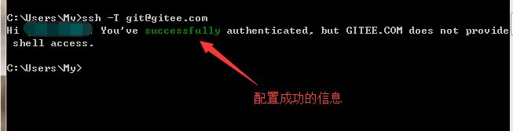
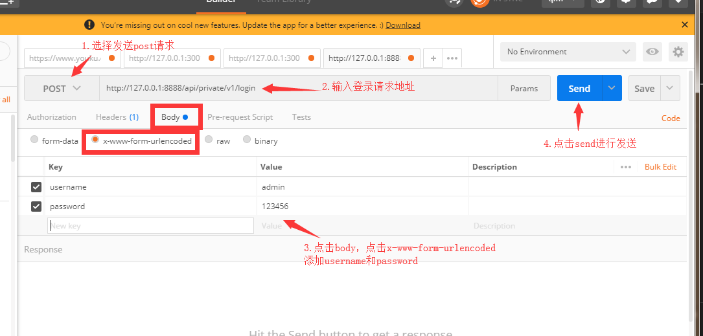
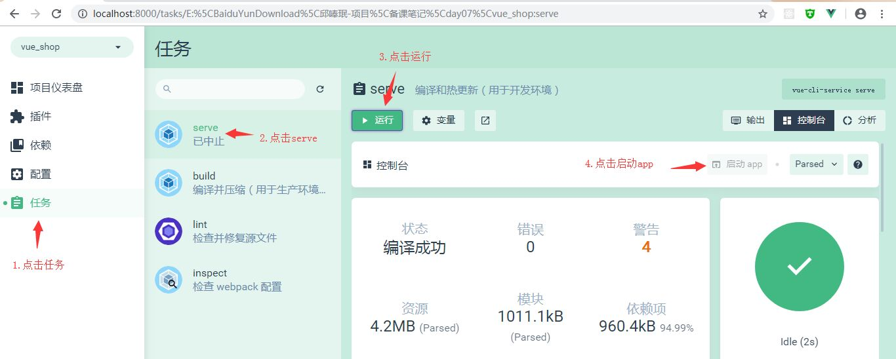

## 今日目标

1. 初始化项目
2. 基于 Vue 技术栈进行项目开发
3. 使用 Vue 的第三方组件进行项目开发
4. 理解前后端分离开发模式

## 1.电商业务概述

- 客户使用的业务服务：PC 端，小程序，移动 web，移动 app
- 管理员使用的业务服务：PC 后台管理端。
- PC 后台管理端的功能：管理用户账号（登录，退出，用户管理，权限管理），商品管理（商品分类，分类参数，商品信息，订单），数据统计
- 电商后台管理系统采用前后端分离的开发模式
- 前端项目是基于 Vue 的 SPA（单页应用程序）项目
- 前端技术栈:Vue,Vue-Router,Element-UI,Axios,Echarts
- 后端技术栈：Node.js,Express,Jwt(模拟 session),Mysql,Sequelize(操作数据库的框架)

## 2.项目初始化

A.安装 Vue 脚手架

B.通过脚手架创建项目

C.配置路由

D.配置 Element-UI:在插件中安装，搜索 vue-cli-plugin-element

E.配置 Axios：在依赖中安装,搜索 axios(运行依赖)

F.初始化 git 仓库

G.将本地项目托管到 github 或者码云中

## 3.码云相关操作

A.注册登录码云账号


B.安装 git
在 Windows 上使用 Git，可以从 Git 官网直接下载安装程序进行安装。
测试命令：git --version

C.点击网站右上角“登录”，登录码云，并进行账号设置


D.在本地创建公钥：在终端运行：ssh-keygen -t rsa -C "xxx@xxx.com"


E.找到公钥地址：
Your identification has been saved in /c/Users/My/.ssh/id_rsa.

Your public key has been saved in /c/Users/My/.ssh/id_rsa.pub.

当我们创建公钥完毕之后，请注意打印出来的信息“Your public key has been saved in”

/c/Users/My/.ssh/id_rsa.pub : c 盘下面的 Users 下面的 My 下面的.ssh 下面的 id_rsa.pub 就是我们创建好的公钥了

E.打开 id_rsa.pub 文件，复制文件中的所有代码，点击码云中的 SSH 公钥，将生成的公钥复制到公钥中


G.测试公钥：打开终端，输入命令
ssh -T git@gitee.com


H.将本地代码托管到码云中
点击码云右上角的+号->新建仓库


I.进行 git 配置：

打开项目所在位置的终端，进行 git 仓库关联


## 4.配置后台项目

A.安装 phpStudy 并导入 mysql 数据库数据


B.安装 nodeJS，配置后台项目,从终端打开后台项目 vue_api_server
然后在终端中输入命令安装项目依赖包：npm install

C.使用 postman 测试 api 接口


## 5.实现登录功能

A.登录状态保持
如果服务器和客户端同源，建议可以使用 cookie 或者 session 来保持登录状态
如果客户端和服务器跨域了，建议使用 token 进行维持登录状态。

B.登录逻辑：
在登录页面输入账号和密码进行登录，将数据发送给服务器
服务器返回登录的结果，登录成功则返回数据中带有 token
客户端得到 token 并进行保存，后续的请求都需要将此 token 发送给服务器，服务器会验证 token 以保证用户身份。

C.添加新分支 login，在 login 分支中开发当前项目 vue_shop：
打开 vue_shop 终端，使用 git status 确定当前项目状态。
确定当前工作目录是干净的之后，创建一个分支进行开发，开发完毕之后将其合并到 master

git checkout -b login

然后查看新创建的分支：git branch
确定我们正在使用 login 分支进行开发


然后执行 vue ui 命令打开 ui 界面，然后运行 serve，运行 app 查看当前项目效果


- 发现现在是一个默认页面，我们需要进行更改，打开项目的 src 目录，点击 main.js 文件（入口文件）

```js
import Vue from "vue";
import App from "./App.vue";
import router from "./router";
import "./plugins/element.js";

Vue.config.productionTip = false;

new Vue({
  router,
  render: (h) => h(App),
}).$mount("#app");
```

- 再打开 App.vue(根组件)，将根组件的内容进行操作梳理(template 中留下根节点，script 中留下默认导出，去掉组件，style 中去掉所有样式)

```js
<template>
  <div id="app">
    <router-view></router-view>
  </div>
</template>

<script>
export default {
  name: 'app'
}
</script>

<style>
</style>
```

- 再打开 router.js(路由)，将 routes 数组中的路由规则清除，然后将 views 删除，将 components 中的 helloworld.vue 删除

```js
import Vue from "vue";
import Router from "vue-router";

Vue.use(Router);

export default new Router({
  routes: [],
});
```

- 在 components 文件夹中新建 Login.vue 组件,添加 template，script，style 标签,style 标签中的 scoped 可以防止组件之间的样式冲突，没有 scoped 则样式是全局的

```js
<template>
    <div class="login_container">

    </div>
</template>

<script>
export default {

}
</script>

<style lang="less" scoped>
.login_container {
  background-color: #2b5b6b;
  height: 100%;
}

</style>
```

- 在 router.js 中导入组件并设置规则
- 在 App.vue 中添加路由占位符

```js
const router = new Router({
  routes: [
    { path: "/", redirect: "/login" },
    { path: "/login", component: Login },
  ],
});
```

- 当我们给 Login.vue 中的内容添加样式的时候，会报错“缺少 less-loader”，需要配置 less 加载器（开发依赖），安装 less(开发依赖)
  
- 然后需要添加公共样式，在 assets 文件夹下面添加 css 文件夹，创建 global.css 文件,添加全局样式

```js
/* 全局样式表 */
html,body,#app{
    width: 100%;
    height: 100%;
    margin: 0;
    padding: 0;
}
```

- 在 main.js 中导入 global.css，使得全局样式生效 import "./assets/css/global.css"
- 然后 Login.vue 中的根元素也需要设置撑满全屏（height:100%）
- 最终 Login.vue 文件中的代码如下

```js
<template>
    <div class="login_container">
        <!-- 登录盒子  -->
        <div class="login_box">
            <!-- 头像 -->
            <div class="avatar_box">
                
            </div>
            <!-- 登录表单 -->
            <el-form :model="loginForm" ref="LoginFormRef" :rules="loginFormRules" label-width="0px" class="login_form">
                <!-- 用户名 -->
                <el-form-item prop="username">
                    <el-input v-model="loginForm.username" prefix-icon="iconfont icon-user" ></el-input>
                </el-form-item>
                <!-- 密码 -->
                <el-form-item prop="password">
                    <el-input type="password" v-model="loginForm.password" prefix-icon="iconfont icon-3702mima"></el-input>
                </el-form-item>
                <!-- 按钮 -->
                <el-form-item class="btns">
                    <el-button type="primary" @click="login">登录</el-button>
                    <el-button type="info" @click="resetLoginForm">重置</el-button>
                </el-form-item>
            </el-form>
        </div>
    </div>
</template>

<script>
export default {
  data() {
    return {
      //数据绑定
      loginForm: {
        username: 'admin',
        password: '123456'
      },
      //表单验证规则
      loginFormRules: {
        username: [
          { required: true, message: '请输入登录名', trigger: 'blur' },
          {
            min: 3,
            max: 10,
            message: '登录名长度在 3 到 10 个字符',
            trigger: 'blur'
          }
        ],
        password: [
          { required: true, message: '请输入密码', trigger: 'blur' },
          {
            min: 6,
            max: 15,
            message: '密码长度在 6 到 15 个字符',
            trigger: 'blur'
          }
        ]
      }
    }
  },
  //添加行为，
  methods: {
    //添加表单重置方法
    resetLoginForm() {
      //this=>当前组件对象，其中的属性$refs包含了设置的表单ref
      //   console.log(this)
      this.$refs.LoginFormRef.resetFields()
    },
    login() {
      //点击登录的时候先调用validate方法验证表单内容是否有误
      this.$refs.LoginFormRef.validate(async valid => {
        console.log(this.loginFormRules)
        //如果valid参数为true则验证通过
        if (!valid) {
          return
        }

        //发送请求进行登录
        const { data: res } = await this.$http.post('login', this.loginForm)
        //   console.log(res);
        if (res.meta.status !== 200) {
          return this.$message.error('登录失败:' + res.meta.msg) //console.log("登录失败:"+res.meta.msg)
        }

        this.$message.success('登录成功')
        console.log(res)
        //保存token
        window.sessionStorage.setItem('token', res.data.token)
        // 导航至/home
        this.$router.push('/home')
      })
    }
  }
}
</script>

<style lang="less" scoped>
.login_container {
  background-color: #2b5b6b;
  height: 100%;
}
.login_box {
  width: 450px;
  height: 300px;
  background: #fff;
  border-radius: 3px;
  position: absolute;
  left: 50%;
  top: 50%;
  transform: translate(-50%, -50%);
  .avatar_box {
    height: 130px;
    width: 130px;
    border: 1px solid #eee;
    border-radius: 50%;
    padding: 10px;
    box-shadow: 0 0 10px #ddd;
    position: absolute;
    left: 50%;
    transform: translate(-50%, -50%);
    background-color: #fff;
    img {
      width: 100%;
      height: 100%;
      border-radius: 50%;
      background-color: #eee;
    }
  }
}
.login_form {
  position: absolute;
  bottom: 0;
  width: 100%;
  padding: 0 20px;
  box-sizing: border-box;
}
.btns {
  display: flex;
  justify-content: flex-end;
}
</style>

```

- 其中我们有用到一下内容，需要进行进一步处理：

1. 添加 element-ui 的表单组件

   在 plugins 文件夹中打开 element.js 文件，进行 elementui 的按需导入

   import Vue from 'vue'

   import { Button } from 'element-ui'

   import { Form, FormItem } from 'element-ui'

   import { Input } from 'element-ui'

   Vue.use(Button)

   Vue.use(Form)

   Vue.use(FormItem)

   Vue.use(Input)

2. 添加第三方字体
   复制素材中的 fonts 文件夹到 assets 中,在入口文件 main.js 中导入 import './assets/fonts/iconfont.css'

   然后直接在 `<el-input prefix-icon="iconfont icon-3702mima"></el-input>`
   接着添加登录盒子

3. 添加表单验证的步骤

   1).给`<el-form>`添加属性:rules="rules"，rules 是一堆验证规则，定义在 script、中

   2).在 script 中添加 rules：export default{ data(){return{......, rules: {
   name: [
   { required: true, message: '请输入活动名称', trigger: 'blur' },
   { min: 3, max: 5, message: '长度在 3 到 5 个字符', trigger: 'blur' }
   ],
   region: [
   { required: true, message: '请选择活动区域', trigger: 'change' }
   ]
   }......

   3).通过<el-form-item>的 prop 属性设置验证规则<el-form-item label="活动名称" prop="name">

4. 导入 axios 以发送 ajax 请求
   打开 main.js，import axios from 'axios';
   设置请求的根路径：axios.defaults.baseURL = 'http://127.0.0.1:8888/api/private/v1/';
   挂载 axios：Vue.prototype.$http = axios;

5. 配置弹窗提示：
   在 plugins 文件夹中打开 element.js 文件，进行 elementui 的按需导入
   import {Message} from 'element-ui'
   进行全局挂载：Vue.prototype.$message = Message;
在login.vue组件中编写弹窗代码：this.$message.error('登录失败')

## 6.登录成功之后的操作

A.登录成功之后，需要将后台返回的 token 保存到 sessionStorage 中
操作完毕之后，需要跳转到/home

```js
login() {
      //点击登录的时候先调用validate方法验证表单内容是否有误
      this.$refs.LoginFormRef.validate(async valid => {
        console.log(this.loginFormRules)
        //如果valid参数为true则验证通过
        if (!valid) {
          return
        }

        //发送请求进行登录
        const { data: res } = await this.$http.post('login', this.loginForm)
        //   console.log(res);
        if (res.meta.status !== 200) {
          return this.$message.error('登录失败:' + res.meta.msg) //console.log("登录失败:"+res.meta.msg)
        }

        this.$message.success('登录成功')
        console.log(res)
        //保存token
        window.sessionStorage.setItem('token', res.data.token)
        // 导航至/home
        this.$router.push('/home')
      })
    }
```

添加一个组件 Home.vue，并为之添加规则

```js
<template>
    <div>
        this is home
        <el-button type="info" @click="logout"> 退出 </el-button>
    </div>
</template>

<script>
export default {
  methods: {
    logout() {
      window.sessionStorage.clear()
      this.$router.push('/login')
    }
  }
}
</script>

<style lang='less' scoped>
</style>
```

添加路由规则

```js
const router = new Router({
  routes: [
    { path: "/", redirect: "/login" },
    { path: "/login", component: Login },
    { path: "/home", component: Home },
  ],
});
```

添加路由守卫
如果用户没有登录，不能访问/home,如果用户通过 url 地址直接访问，则强制跳转到登录页面
打开 router.js

```js
import Vue from "vue";
import Router from "vue-router";
import Login from "./components/Login.vue";
import Home from "./components/Home.vue";

Vue.use(Router);

const router = new Router({
  routes: [
    { path: "/", redirect: "/login" },
    { path: "/login", component: Login },
    { path: "/home", component: Home },
  ],
});

//挂载路由导航守卫,to表示将要访问的路径，from表示从哪里来，next是下一个要做的操作
router.beforeEach((to, from, next) => {
  if (to.path === "/login") return next();

  //获取token
  const tokenStr = window.sessionStorage.getItem("token");

  if (!tokenStr) return next("/login");

  next();
});

export default router;
```

- 实现退出功能
- 在 Home 组件中添加一个退出功能按钮,给退出按钮添加点击事件，添加事件处理代码如下：

```js
export default {
  methods: {
    logout() {
      window.sessionStorage.clear();
      this.$router.push("/login");
    },
  },
};
```

### 补充

A.处理 ESLint 警告
打开脚手架面板，查看警告信息
[图片]
默认情况下，ESLint 和 vscode 格式化工具有冲突，需要添加配置文件解决冲突。
在项目根目录添加 .prettierrc 文件

```js
{
    "semi":false,
    "singleQuote":true
}
```

打开.eslintrc.js 文件，禁用对 space-before-function-paren 的检查:

```js
  rules: {
    'no-console': process.env.NODE_ENV === 'production' ? 'error' : 'off',
    'no-debugger': process.env.NODE_ENV === 'production' ? 'error' : 'off',
    'space-before-function-paren' : 0
  },
```

B.合并按需导入的 element-ui

```js
import Vue from "vue";
import { Button, Form, FormItem, Input, Message } from "element-ui";

Vue.use(Button);
Vue.use(Form);
Vue.use(FormItem);
Vue.use(Input);
// 进行全局挂载：
Vue.prototype.$message = Message;
```

C.将代码提交到码云

新建一个项目终端,输入命令‘git status’查看修改过的与新增的文件内容

将所有文件添加到暂存区：git add .

将所有代码提交到本地仓库：git commit -m "添加登录功能以及/home 的基本结构"

查看分支： git branch 发现所有代码都被提交到了 login 分支

将 login 分支代码合并到 master 主分支，先切换到 master：git checkout master

在 master 分支进行代码合并：git merge login

将本地的 master 推送到远端的码云：git push

推送本地的子分支到码云，先切换到子分支：git checkout 分支名

然后推送到码云：git push -u origin 远端分支名
