# 微信小程序开发学习

## 一、开发文档

https://developers.weixin.qq.com/miniprogram/dev/devtools/devtools.html

## 二、学习网址

https://www.bilibili.com/video/BV1nE41117BQ?p=5&spm_id_from=pageDriver

## 三、配置小程序

### 1. 全局配置

https://developers.weixin.qq.com/miniprogram/dev/framework/config.html#%E5%85%A8%E5%B1%80%E9%85%8D%E7%BD%AE

### 2. 页面配置

https://developers.weixin.qq.com/miniprogram/dev/framework/config.html#%E9%A1%B5%E9%9D%A2%E9%85%8D%E7%BD%AE

### 3. sitemap 配置 （需要发布时配置）

developers.weixin.qq.com/miniprogram…

## 四、小程序基础

### 1. 常用标签

- text 标签 （类似于 web 中的 span 标签）
- view 标签 （相当于 web 中的 div 标签）
- block 标签 （相当于占位标签）
- checkbox （单选框）

### 2. 模板语法

- 数据绑定：在页面中的 js 中定义了变量时，可以使用模板语法来使用变量.js 中的代码

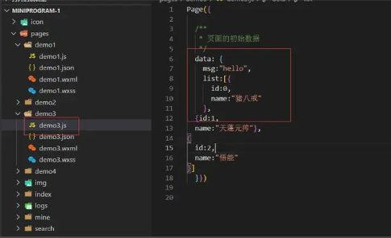

wxml 中的调用：

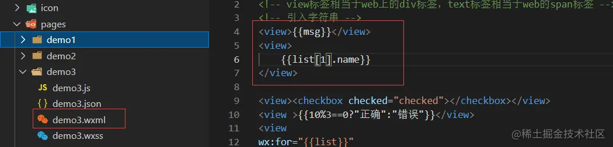

### 2. 运算

包括数字运算、字符串运算、三元运算、条件语句

```js
<!--数字加减-->
<view>
    {{1+1}}
</view>

<!--字符串拼接-->
<view>
    {{'1'+'1'}}
</view>

  <!--三元表达式-->
<view >{{10%3==0?"正确":"错误"}}</view>
 <!--条件渲染-->

<view
```

### 3. 数组和对象循环

```js
<view
wx:for="{{list}}"
wx:for-item="item"
wx:for-index="index"
wx:key="key">

索引：{{index}}
值：{{item.name}}
</view>
```

### 4. 条件循环

```js
<view wx:if="{{true}}">显示</view>
<view wx:if="{{false}}">隐藏</view>
<view wx:if="{{false}}">1</view>
<view wx:elif="{{false}}">2</view>
<view wx:else="{{true}}">3</view>
```

#### 4.1 hidden

```js
<view hidden="{{true}}">嘻嘻哈哈</view>
<view hidden="{{false}}">再笑</view>
<view hidden="{{}}">还笑</view>
```

### 5. 事件绑定

#### 5.1 input 事件绑定

1. 需要给 input 绑定事件，值改变时就会触发
   绑定关键字：bindinput
2. 如何获取输入框的值：e.detail.value
3. 把输入框的值赋值到 data 中，不能以 this.data.num =e.detail.value 这样写

```js
// 正确的写法：
this.setData({
  num: e.detail.value,
});
```

```js
<input  type="text" value="" bindinput="handleInput">

</input>

<view>
    {{num}}
</view>

```

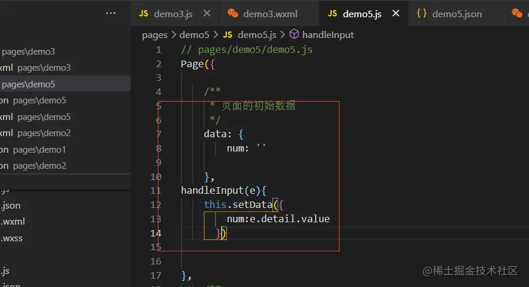

#### 5.2 button 事件绑定

给按钮绑定事件

1.  bindtap
2.  无法在小程序当中的事件中直接传参，比如`<button bindtap="handleTap(1)">+</button>`
3.  需要通过自定义属性的方式来传递参数 data-operation='{{1}}'
4.  可以在事件源中获取参数

```js
<input type="text" value="{{num}}" bindinput="handleInput"></input>
```

```js
<button bindtap="handleTap" data-operation="{{1}}">+</button>
<button bindtap="handleTap" data-operation="{{-1}}">-</button>
<view>
    {{num}}
</view>
```

```js
handleTap(e){
    // 获取自定义属性operation
     const {operation}=e.currentTarget.dataset
   this.setData({
       num:this.data.num +=operation
   })
},
```

### 6. 样式

#### 6.1 样式 rpx

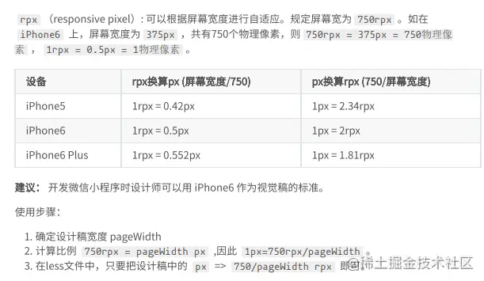

#### 6.2 样式导入

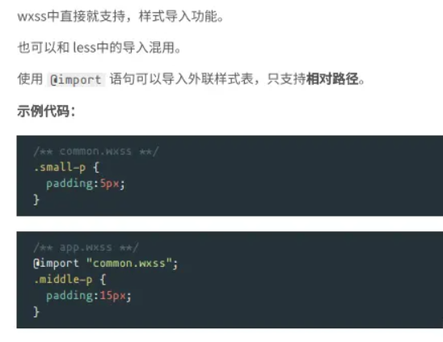

#### 6.3 选择器

特别需要注意，小程序不支持通配符选择器 \* ，因此以下代码无效。

```js
* {
  margin: 0;
  padding: 0;
  box-sizing: border-box
}
```

目前支持的选择器有：

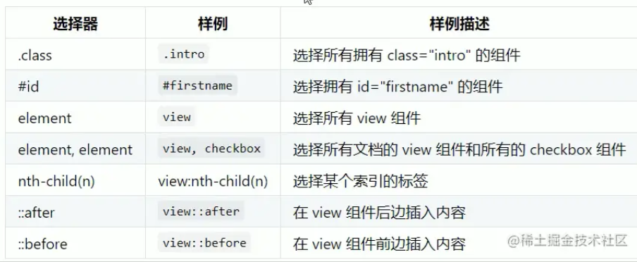

#### 6.4 小程序中使用 less

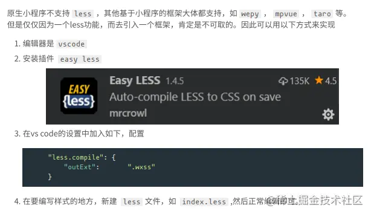

### 7. 小程序常见的组件

view、text、rich-text、button、image、navigator、icon、swiper、radio、checkbox 等

#### 1. view

类似于 div 标签

#### 2. text

1. 文本标签
2. 只能嵌套 text
3. 长安文字可以复制（只有该标签有这个功能）
4. 可以对回车、空格进行编码

| 属性名     | 类型    | 默认值 | 说明         |
| ---------- | ------- | ------ | ------------ |
| selectable | Boolean | false  | 文本是否可选 |
| decode     | Boolean | false  | 是否解码     |

#### 3. image

1. 图片标签、image 组件默认宽度是 320px、高度 240px
2. 支持懒加载

| 属性名    | 类型    | 默认值        | 说明                 |
| --------- | ------- | ------------- | -------------------- |
| src       | string  |               | 图片资源地址         |
| mode      | string  | 'scaleToFill' | 图片裁剪、缩放的模式 |
| lazy-load | Boolean | false         | 图片懒加载           |

- mode 有效值：
  - mode 有 13 种模式，4 种缩放模式、9 种裁剪模式

https://developers.weixin.qq.com/miniprogram/dev/component/image.html

#### 4. swiper（轮播图组件）

1. 轮播图外层容器 swiper
2. 每一个轮播项 swiper-item
3. swiper 标签存在默认样式

- width:100%
- height:150px imgage 默认宽度和高度为 320\*240
- swiper 高度无法实现内容撑开

4. 先找出来，原图的宽度和高度 等比例给 swiper 定宽度和高度

- 例如原图的宽度和高度为 1125\*352px
- swiper 宽度\swiper 高度=原图的宽度/原图的高度
- swiper 高度 =swiper 宽度\*原图的高度/原图的宽度
- height：100vw(750rpx)\*352/1125

5. autoplay 自动轮播
6. interval 轮播间隙时间
7. circular 循环轮播
8. indicator-dots 显示轮播小圆点
9. indicator-color 轮播小圆点颜色

```js
<swiper
  autoplay
  interval="3000"
  circular
  indicator-dots
  indicator-color="skyblue"
>
  <swiper-item>
    <image
      mode="widthFix"
      src="//img.alicdn.com/imgextra/i1/89/O1CN01LK1zcs1CWnvSwlhAI_!!89-0-luban.jpg"
    ></image>
  </swiper-item>
  <swiper-item>
    <image
      mode="widthFix"
      src="https://aecpm.alicdn.com/simba/img/TB1CWf9KpXXXXbuXpXXSutbFXXX.jpg_q50.jpg"
    ></image>
  </swiper-item>
  <swiper-item>
    <image
      mode="widthFix"
      src="https://aecpm.alicdn.com/simba/img/TB15tIjGVXXXXcoapXXSutbFXXX.jpg"
    ></image>
  </swiper-item>
  <swiper-item>
    <image
      mode="widthFix"
      s
      src="//img.alicdn.com/imgextra/i2/2206686532409/O1CN01sd1h9c1TfMnX6tzgP_!!2206686532409-0-lubanimage.jpg"
    ></image>
  </swiper-item>
</swiper>
```

wxss:

```js
swiper{
  width: 100%;
  height: cal(750rpx*352/1125);
}
image{
  width: 100%;
}
```

https://developers.weixin.qq.com/miniprogram/dev/component/swiper.html

#### 5. navigator

导航组件、类似于`<a>`标签

- 是块级元素
- URL 要跳转的页面路径

```xml
<navigator url="/pages/demo/swiper">轮播图页面</navigator>
```

https://developers.weixin.qq.com/miniprogram/dev/component/navigator.html

#### 6. rich-text

类似于 vue 中的 html，可以把字符串解析成对应标签

https://developers.weixin.qq.com/miniprogram/dev/component/navigator.html

#### 7. button 标签

https://developers.weixin.qq.com/miniprogram/dev/component/button.html

- button 的外观属性

  - 常用的就是 size、type、plain、disabled、loading
  - `size`：按钮的大小，default 默认大小、mini 小尺寸
  - `type`：按钮的样式类型，primary 绿色、default 白色、warn 红色
  - `plain`：false，按钮是否镂空，背景色透明
  - `disabled`：false，是否禁用
  - `loading`：false，名称前是否带 loading 图标

- button 的开放能力

```xml
<!--pages/demo8/button.wxml-->
<button size="mini" type="primary" plain loading disabled>按钮</button>
```

- button 开放功能:

open-type：

1. `contact` 直接打开，客服对话功能，需要在微信小程序的后台配置
2. `share` 转发当前小程序，到微信朋友圈中，不能把小程序分享到朋友圈
3. `getPhoneNumber` 获取当前手机用户的手机号码信息，不是企业的小程序账号，没有权限来获取用户的手机号码

（1）.在这个按钮上绑定一个事件，bindgetphonenumber

（2）.在回调函数中，通过参数来获取信息

（3）.获取到信息已经加密过了

需要用户待见小程序的后台服务器，在后台服务器中进行解析手机号码，返回到小程序当中，就可以看到信息了

4. `getUserInfo` 获取当前用户的个人信息

（1）.在这个按钮上绑定一个事件，bindgetuserinfo

（2）.可以直接获取，不存在加密字段

5. `launchApp` 在小程序当中直接打开 app

（1）.需要先在 app 中，通过 app 的某个链接，打开小程序

（2）.在小程序中再通过这个功能重新打开 app

（3）.可以找到京东的 app，体验一下

6. `openSetting` 打开小程序内置的授权页面

（1）.授权页面中，只会出现用户曾经点击过的权限

7. `feedback` 打开小程序内置意见的反馈页面

```xml
<button open-type="contact">contact</button>
<button open-type="share">share</button>
<button open-type="getPhoneNumber" bindgetphonenumber="getPhoneNumber">getPhoneNumber</button>
<button open-type="getUserInfo" bindgetuserinfo="getUserInfo">getUserInfo</button>
<button open-type="launchApp">launchApp</button>
<button open-type="openSetting">openSetting</button>
<button open-type="feedback">feedback</button>
```

#### 8. icon

- type 图标的类型
- size 图标大小
- color 图标颜色

```xml
<icon type="success" size="60" color="skyblue"></icon>
```

#### 9. radio （单选框）

- radio 单选框必须要和 radio-group 来使用
- value 选中的单选框的值
- 需要给 radio-group 绑定 change 事件
- 需要在页面中显示选中的值
- 利用 color 可以改变颜色

属性说明：

| 属性     | 类型    | 默认值  | 必填 | 说明                                                                           |
| -------- | ------- | ------- | ---- | ------------------------------------------------------------------------------ |
| value    | string  |         | 否   | radio 标识。当该 radio 选中时，radio-group 的 change 事件会携带 radio 的 value |
| checked  | Boolean | false   | 否   | 当前是否选中                                                                   |
| disabled | Boolean | false   | 否   | 是否禁用                                                                       |
| color    | string  | #09BB07 | 否   | radio 的颜色，同 css 的 color                                                  |

示例：

```xml
<view class="page-body">
  <view class="page-section">
    <view class="page-section-title">默认样式</view>
    <label class="radio">
      <radio value="r1" checked="true"/>选中
    </label>
    <label class="radio">
      <radio value="r2" />未选中
    </label>
  </view>


  <view class="page-section">
    <view class="page-section-title">推荐展示样式</view>
    <view class="weui-cells weui-cells_after-title">
      <radio-group bindchange="radioChange">
        <label class="weui-cell weui-check__label" wx:for="{{items}}" wx:key="{{item.value}}">

          <view class="weui-cell__hd">
            <radio value="{{item.value}}" checked="true"/>
          </view>
          <view class="weui-cell__bd">{{item.name}}</view>
        </label>
      </radio-group>
    </view>
  </view>
</view>
```

```js
Page({
  onShareAppMessage() {
    return {
      title: "radio",
      path: "page/component/pages/radio/radio",
    };
  },

  data: {
    items: [
      { value: "USA", name: "美国" },
      { value: "CHN", name: "中国", checked: "true" },
      { value: "BRA", name: "巴西" },
      { value: "JPN", name: "日本" },
      { value: "ENG", name: "英国" },
      { value: "FRA", name: "法国" },
    ],
  },

  radioChange(e) {
    console.log("radio发生change事件，携带value值为：", e.detail.value);

    const items = this.data.items;
    for (let i = 0, len = items.length; i < len; ++i) {
      items[i].checked = items[i].value === e.detail.value;
    }

    this.setData({
      items,
    });
  },
});
```

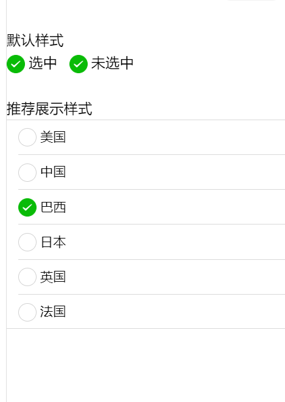

#### 10. checkbox （复选框）

属性说明：

| 属性     | 类型    | 默认值  | 必填 | 说明                                                                              |
| -------- | ------- | ------- | ---- | --------------------------------------------------------------------------------- |
| value    | string  |         | 否   | checkbox 标识，选中时触发 checkbox-group 的 change 事件，并携带 checkbox 的 value |
| disabled | Boolean | false   | 否   | 是否禁用                                                                          |
| checked  | Boolean | false   | 否   | 当前是否被选中，可用来设置默认选中                                                |
| color    | string  | #09BB07 | 否   | checkbox 的颜色，同 css 的 color                                                  |

示例:

```xml
<view class="container">
  <view class="page-body">
    <view class="page-section page-section-gap">
      <view class="page-section-title">默认样式</view>
      <label class="checkbox">
        <checkbox value="cb" checked="true"/>选中
      </label>
      <label class="checkbox">
        <checkbox value="cb" />未选中
      </label>
    </view>

    <view class="page-section">
      <view class="page-section-title">推荐展示样式</view>
      <view class="weui-cells weui-cells_after-title">
        <checkbox-group bindchange="checkboxChange">
          <label class="weui-cell weui-check__label" wx:for="{{items}}" wx:key="{{item.value}}">
            <view class="weui-cell__hd">
              <checkbox value="{{item.value}}" checked="{{item.checked}}"/>
            </view>
            <view class="weui-cell__bd">{{item.name}}</view>
          </label>
        </checkbox-group>
      </view>
    </view>
  </view>

</view>
```

```js
Page({
  onShareAppMessage() {
    return {
      title: "checkbox",
      path: "page/component/pages/checkbox/checkbox",
    };
  },

  data: {
    items: [
      { value: "USA", name: "美国" },
      { value: "CHN", name: "中国", checked: "true" },
      { value: "BRA", name: "巴西" },
      { value: "JPN", name: "日本" },
      { value: "ENG", name: "英国" },
      { value: "FRA", name: "法国" },
    ],
  },

  checkboxChange(e) {
    console.log("checkbox发生change事件，携带value值为：", e.detail.value);

    const items = this.data.items;
    const values = e.detail.value;
    for (let i = 0, lenI = items.length; i < lenI; ++i) {
      items[i].checked = false;

      for (let j = 0, lenJ = values.length; j < lenJ; ++j) {
        if (items[i].value === values[j]) {
          items[i].checked = true;
          break;
        }
      }
    }

    this.setData({
      items,
    });
  },
});
```

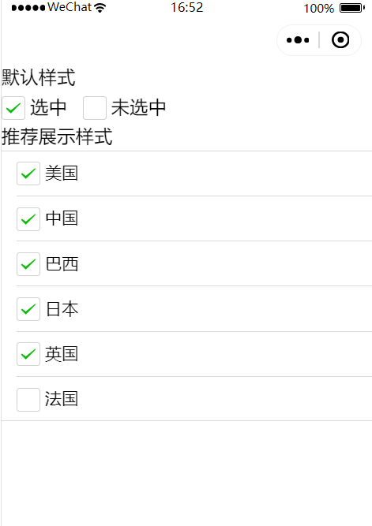

## 五、自定义组件

### 1. 组件使用步骤

- 创建自定义组件，现在最外层定义一个 components 文件夹，在 Tabs 里面创建一个组件，包含四个文件。

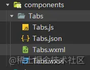

- 引入组件

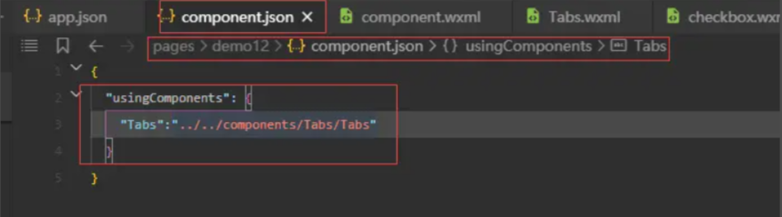

- 使用组件

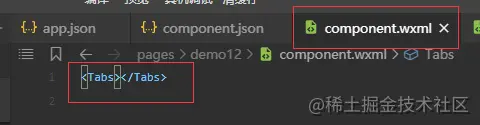

### 2. 组件之间的通信

- 父传子

  - 在组件标签中定义属性

  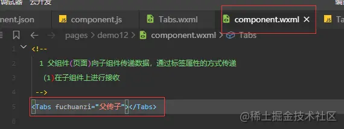

  - 在组件的 properties 存放传递的属性

  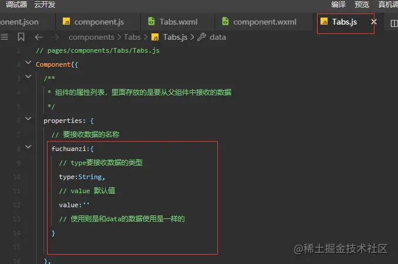

  - 调用数据的方法和调用 data 中数据的方法一样
    - 在 Tabs.wxml 中
    - `<view>{{fuchuanzi}}</view>`

- 子传父

  - 在子组件中定义一个自定义事件

  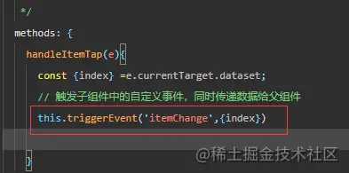

  - 在父组件里绑定子组件传过来的事件

    - `<Tabs tabs="{{tabs}}" binditemChange="handleItemChange"></Tabs>`

    - 在父组件 js 中写方法

    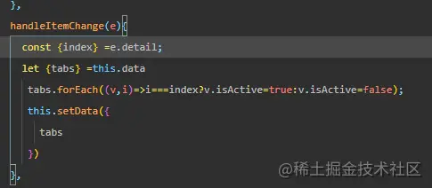

效果：

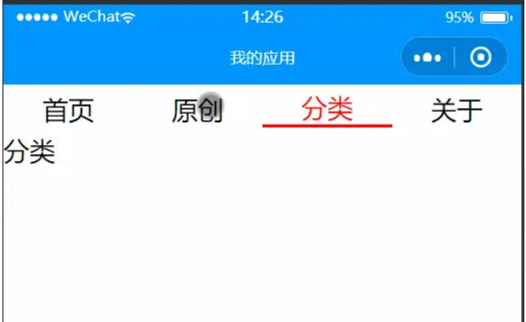

### 3. 插槽

1. 定义一个插槽

```xml
<view class="tabs">
<view class="tabs_title">

<!-- <view class="title_item active">首页</view>
<view class="title_item">首页</view>
<view class="title_item">首页</view>
<view class="title_item">首页</view> -->

<view
wx:for="{{tabs}}"
wx:key="id"
wx:for-item="item"
class="title_item {{item.isActive ? 'active' : ''}}"
bindtap="handleItemTap"
data-index="{{index}}"
>{{item.name}}</view>
</view>

<view class="tabs_content">

<!-- slot标签，其实就是一个占位符，插槽
等到父组件调用子组件的时候，再传递标签过来，最终这些被传递的标签就会替换slot插槽的位置 -->

<slot></slot>

</view>
</view>
```

2. 使用

```xml
<Tabs tabs="{{tabs}}" binditemChange="handleItemChange">
  <bolck wx:if="{{tabs[0].isActive}}">首页</block>
  <bolck wx:elif="{{tabs[1].isActive}}">原创</block>
  <bolck wx:elif="{{tabs[2].isActive}}">分类</block>
  <bolck wx:else="{{tabs[3].isActive}}">关于</block>
</Tabs>
```

https://developers.weixin.qq.com/miniprogram/dev/framework/custom-component/

### 4. 生命周期

#### 4.1 应用生命周期

```js
//app.js
App({
  // 1 应用第一次启动就会触发的事件
  onLaunch() {
    //在应用第一次启动的时候，获取用户的个人信息
    console.log("onlaunch");
  },
  // 2 应用被用户看到时触发
  onShow() {
    // 对应用的数据或者页面效果做一些重置
    console.log("onshow");
  },
  // 3 应用别隐藏时触发
  onHide() {
    // 暂停或者清除定时器
    console.log("onHide");
  },
  // 4 应用的代码发生了报错的时候就会触发
  onError(err) {
    // 在应用发生代码错误的时候，收集用户的错误信息，通过异步请求，将错误的信息发送后台去
    console.log("onError");
    console.log(err);
  },
  // 5 页面找不到就会触发
  // 应用第一次启动的时候，如果找不到第一个入口页面才会触发
  onPageNotFound() {
    // 如果页面不存在了 通过js的方式来重新跳转页面 重新跳到第二个首页
    // 不能跳到tabbar页面 与导航组件类似
    wx.navigateTo({
      url: "/pages/demo9/icon",
    });
    console.log("onPageNotFound");
  },
});
```

#### 4.2 页面生命周期

```js
// pages/demo13/pagelifetime.js
Page({
  /**
   * 页面的初始数据
   */
  data: {},

  /**
   * 生命周期函数--监听页面加载
   */
  onLoad: function (options) {
    // 在onLoad中发送异步请求
    console.log("onLoad");
  },

  /**
   * 生命周期函数--监听页面初次渲染完成
   */
  onReady: function () {
    console.log("onReady");
  },

  /**
   * 生命周期函数--监听页面显示
   */
  onShow: function () {
    console.log("onShow");
  },

  /**
   * 生命周期函数--监听页面隐藏
   */
  onHide: function () {
    console.log("onHide");
  },

  /**
   * 生命周期函数--监听页面卸载
   */
  onUnload: function () {
    console.log("onUnload");
  },

  /**
   * 页面相关事件处理函数--监听用户下拉动作
   */
  onPullDownRefresh: function () {
    console.log("onPullDownRefresh");
  },

  /**
   * 页面上拉触底事件的处理函数
   */
  onReachBottom: function () {
    console.log("onReachBottom");
  },

  /**
   * 用户点击右上角分享
   */
  onShareAppMessage: function () {
    console.log("onShareAppMessage");
  },
});
```

https://developers.weixin.qq.com/miniprogram/dev/framework/custom-component/lifetimes.html
