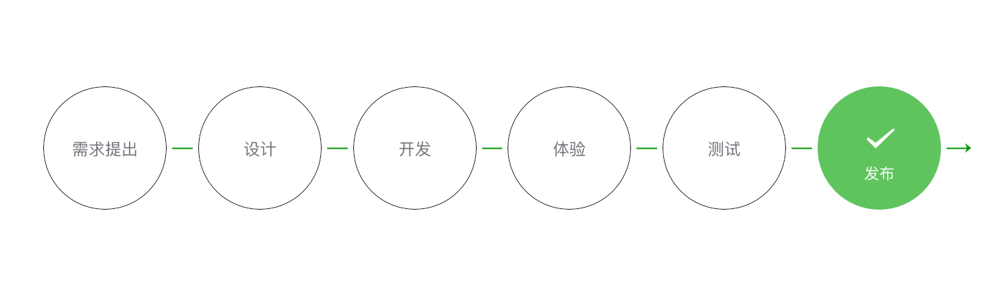

# 指南

## 一、小程序代码构成

1. `.json`后缀的 JSON 配置文件
2. `.wxml`后缀的 WXML 模板文件
3. `.wxss`后缀的 WXSS 样式文件
4. `.js`后缀的 JS 脚本逻辑文件

### 1. JSON 配置

JSON 是一种数据格式，在小程序中扮演静态配置的角色。不是编程语言。

#### 1.1.1 小程序配置 app.json

app.json 是当前小程序的全局配置，包括了小程序的**所有页面路径、界面表现、网络超时时间、底部 tab 等**。

例如：

```json
{
  "pages": ["pages/index/index", "pages/logs/logs"],
  "window": {
    "backgroundTextStyle": "light",
    "navigationBarBackgroundColor": "#fff",
    "navigationBarTitleText": "Weixin",
    "navigationBarTextStyle": "black"
  }
}
```

- **pages 字段：**用于描述当前小程序所有页面路径，是为了让微信客户端知道当前你的小城苏定义在哪个目录。
- **window 字段：**定义小程序所有页面的顶部背景颜色、文字颜色定义等。

#### 1.1.2 工具配置 project.config.json

在使用一个工具的时候，都会针对各自喜好做一些个性化配置，例如界面颜色、编译配置等等，当你换了另外一台电脑重新安装工具的时候，你还要重新配置。

考虑到这点，小程序开发者工具在每个项目的根目录都会生成一个 project.config.json，你在工具上做的任何配置都会写入到这个文件，`当你重新安装工具或者换电脑工作时，你只要载入同一个项目的代码包，开发者工具就自动会帮你恢复到当时你开发项目时的个性化配置，其中会包括编辑器的颜色、代码上传时自动压缩等等一系列选项`。

#### 1.1.3 页面配置 page.json

page.json 其实用来表示 pages/logs 目录下的 logs.json 这类和小程序页面相关的配置。

如果你整个小程序的风格是蓝色调，那么你可以在 app.json 里边声明顶部颜色是蓝色即可。实际情况可能不是这样，可能你小程序里边的每个页面都有不一样的色调来区分不同功能模块，因此我们提供了 page.json，让开发者`可以独立定义每个页面的一些属性，例如刚刚说的顶部颜色、是否允许下拉刷新等等`。

### 1.2 JSON 语法

JSON 配置的注意事项：

JSON 文件都是`被包裹在一个大括号中 {}，`通过 key-value 的方式来表达数据。`JSON 的 Key 必须包裹在一个双引号中，`在实践中，编写 JSON 的时候，忘了给 Key 值加双引号或者是把双引号写成单引号是常见错误。

`JSON 的值只能是以下几种数据格式，`其他任何格式都会触发报错，例如 JavaScript 中的 undefined。

- 数字，包含浮点数和整数
- 字符串，需要包裹在双引号中
- Bool 值，true 或者 false
- 数组，需要包裹在方括号中 []
- 对象，需要包裹在大括号中 {}
- Null

还需要注意的是 `JSON 文件中无法使用注释`，试图添加注释将会引发报错。

### 2. WXML 模板

网页编程采用的是 HTML + CSS + JS 这样的组合，其中 HTML 是用来描述当前这个页面的结构，CSS 用来描述页面的样子，JS 通常是用来处理这个页面和用户的交互。

同样道理，在小程序中也有同样的角色，其中 WXML 充当的就是类似 HTML 的角色。打开 pages/index/index.wxml，你会看到以下的内容:

```xml
<view class="container">
  <view class="userinfo">
    <button wx:if="{{!hasUserInfo && canIUse}}"> 获取头像昵称 </button>
    <block wx:else>
      <image src="{{userInfo.avatarUrl}}" background-size="cover"></image>
      <text class="userinfo-nickname">{{userInfo.nickName}}</text>
    </block>
  </view>
  <view class="usermotto">
    <text class="user-motto">{{motto}}</text>
  </view>
</view>
```

和 HTML 非常相似，WXML 由标签、属性等等构成。

不同点：

1. 标签名字不一样

往往写 HTML 的时候，经常会用到的标签是` div, p, span，`开发者在写一个页面的时候可以根据这些基础的标签组合出不一样的组件，例如日历、弹窗等等。换个思路，既然大家都需要这些组件，为什么我们不能把这些常用的组件包装起来，大大提高我们的开发效率。

从上边的例子可以看到，`小程序的 WXML 用的标签是 view, button, text 等等`，这些标签就是小程序给开发者包装好的基本能力，我们`还提供了地图、视频、音频等等组件能力`。

2. 多了一些 `wx:if` 这样的属性以及 `{{ }}` 这样的表达式

在网页的一般开发流程中，我们通常会通过 JS 操作 DOM (对应 HTML 的描述产生的树)，以引起界面的一些变化响应用户的行为。例如，用户点击某个按钮的时候，JS 会记录一些状态到 JS 变量里边，同时通过 DOM API 操控 DOM 的属性或者行为，进而引起界面一些变化。当项目越来越大的时候，你的代码会充斥着非常多的界面交互逻辑和程序的各种状态变量，显然这不是一个很好的开发模式，因此就有了 MVVM 的开发模式（例如 React, Vue），提倡把渲染和逻辑分离。简单来说就是不要再让 JS 直接操控 DOM，JS 只需要管理状态即可，然后再通过一种模板语法来描述状态和界面结构的关系即可。

小程序的框架也是用到了这个思路，如果你需要把一个 Hello World 的字符串显示在界面上。

WXML 是这么写 :

```xml
<text>{{msg}}</text>
```

JS 只需要管理状态即可:

```js
this.setData({ msg: "Hello World" });
```

**通过 {{ }} 的语法把一个变量绑定到界面上，我们称为数据绑定**。仅仅通过数据绑定还不够完整的描述状态和界面的关系，还需要 `if/else, for 等控制能力`，在小程序里边，这些`控制能力都用 wx: 开头的属性来表达`。

### 3. WXSS 样式

WXSS 具有 CSS 大部分的特性，小程序在 WXSS 也做了一些扩充和修改。

1. `新增了尺寸单位`。在写 CSS 样式时，开发者需要考虑到手机设备的屏幕会有不同的宽度和设备像素比，采用一些技巧来换算一些像素单位。`WXSS 在底层支持新的尺寸单位 rpx` ，开发者可以免去换算的烦恼，只要交给小程序底层来换算即可，由于换算采用的浮点数运算，所以运算结果会和预期结果有一点点偏差。

2. `提供了全局的样式和局部样式`。和前边 app.json, page.json 的概念相同，你可以写一个 **app.wxss 作为全局样式，会作用于当前小程序的所有页面，局部页面样式 page.wxss 仅对当前页面生效**。

3. 此外 WXSS 仅支持部分 CSS 选择器

### 4. JS 逻辑交互

一个服务仅仅只有界面展示是不够的，还需要和用户做交互：响应用户的点击、获取用户的位置等等。在小程序里边，我们就通过编写 JS 脚本文件来处理用户的操作。

```js
<view>{{ msg }}</view>
<button bindtap="clickMe">点击我</button>
```

点击 button 按钮的时候，我们希望把界面上 msg 显示成 "Hello World"，于是我们在 button 上声明一个属性: bindtap ，在 JS 文件里边声明了 clickMe 方法来响应这次点击操作：

```js
Page({
  clickMe: function () {
    this.setData({ msg: "Hello World" });
  },
});
```

## 二、小程序宿主环境

### 1. 渲染层 和 逻辑层

小程序的运行环境分成渲染层和逻辑层，其中 `WXML 模板和 WXSS 样式工作在渲染层，JS 脚本工作在逻辑层`。

小程序的渲染层和逻辑层分别由 2 个线程管理：

- 渲染层的界面使用了 WebView 进行渲染；

- 逻辑层采用 JsCore 线程运行 JS 脚本。一

个小程序存在多个界面，所以`渲染层存在多个 WebView 线程`，这两个线程的通信会经由微信客户端（下文中也会采用 Native 来代指微信客户端）做中转，逻辑层发送网络请求也经由 Native 转发，小程序的通信模型下图所示。


### 2. 程序 与 界面

微信客户端在打开小程序之前，会把整个小程序的代码包下载到本地。

紧接着通过 app.json 的 pages 字段就可以知道你当前小程序的所有页面路径:

```json
{
  "pages": ["pages/index/index", "pages/logs/logs"]
}
```

写在 pages 字段的第一个页面就是这个小程序的首页（打开小程序看到的第一个页面）。

于是微信客户端就把首页的代码装载进来，通过小程序底层的一些机制，就可以渲染出这个首页。

小程序启动之后，在 app.js 定义的 App 实例的 onLaunch 回调会被执行:

```js
App({
  onLaunch: function () {
    // 小程序启动之后 触发
  },
});
```

整个小程序只有一个 App 实例，是全部页面共享的。

**`如何实现一个小程序页面：`**


在 pages/home 下包含了 4 中文件：

1. 微信客户端会先根据 home.json 配置生成一个界面，顶部的颜色和文字都可以在这个 json 文件里面定义好。
2. 紧接着客户端就会装载这个页面的 WXML 结构和 WXSS 样式
3. 最后客户端会装载 home.js，你可以看到 home.js 的大体内容就是:

```js
Page({
  data: {
    // 参与页面渲染的数据
    logs: [],
  },
  onLoad: function () {
    // 页面渲染后 执行
  },
});
```

Page 是一个页面构造器，这个构造器就生成了一个页面。在生成页面的时候，小程序框架会把 data 数据和 index.wxml 一起渲染出最终的结构，于是就得到了你看到的小程序的样子。

在渲染完界面之后，页面实例就会收到一个 onLoad 的回调，你可以在这个回调处理你的逻辑。

### 3. 组件

小程序提供了丰富的基础组件给开发者，开发者可以像搭积木一样，组合各种组件拼合成自己的小程序。

就像 HTML 的 div, p 等标签一样，在小程序里边，你只需要在 WXML 写上对应的组件标签名字就可以把该组件显示在界面上，例如，你需要在界面上显示地图，你只需要这样写即可：

```xml
<map></map>
```

使用组件的时候，`还可以通过属性传递值给组件，让组件可以以不同的状态去展现`，例如，我们希望地图一开始的中心的经纬度是广州，那么你需要声明地图的 longitude（中心经度） 和 latitude（中心纬度）两个属性:

```js
<map longitude="广州经度" latitude="广州纬度"></map>
```

组件的内部行为也会通过事件的形式让开发者可以感知，例如用户点击了地图上的某个标记，你可以在 js 编写 markertap 函数来处理：

```js
<map bindmarkertap="markertap" longitude="广州经度" latitude="广州纬度"></map>
```

也可以通过 style 或者 class 来控制组件的外层样式，以便适应你的界面宽度高度等等。

### 4. API

为了让开发者可以很方便的调起微信提供的能力，例如获取用户信息、微信支付等等，小程序提供了很多 API 给开发者去使用。

要获取用户的地理位置时，只需要：

```js
wx.getLocation({
  type: "wgs84",
  success: (res) => {
    var latitude = res.latitude; // 纬度
    var longitude = res.longitude; // 经度
  },
});
```

调用微信扫一扫能力，只需要：

```js
wx.scanCode({
  success: (res) => {
    console.log(res);
  },
});
```

需要注意的是：多数 API 的回调都是异步，需要处理好代码逻辑的异步问题。

## 三、小程序协同工作和发布

### 1. 协同工作

多数情况下，一个团队多人同时参与同一个小程序项目，每个角色所承担的工作或者权限不一样，中大公司的分工更为仔细。为了更形象的表达团队不同角色的关系以及权限的管理，我们通过虚拟一个项目成员组织结构来描述日常如何协同合作完成一个小程序的发布，组织关系如图所示。


提需求到发布流程



### 2. 小程序成员管理

小程序成员管理包括对小程序项目成员及体验成员的管理。

- **项目成员：**表示参与小程序开发、运营的成员，可登录小程序管理后台，包括运营者、开发者及数据分析者。管理员可在“成员管理”中添加、删除项目成员，并设置项目成员的角色。

- **体验成员：**表示参与小程序内测体验的成员，可使用体验版小程序，但不属于项目成员。管理员及项目成员均可添加、删除体验成员。

各权限功能说明：

- 开发者权限：可使用小程序开发者工具及开发版小程序进行开发
- 体验者权限：可使用体验版小程序
- 登录：可登录小程序管理后台，无需管理员确认
- 数据分析：使用小程序统计模块功能查看小程序数据
- 微信支付：使用小程序微信支付（虚拟支付）模块
- 推广：使用小程序流量主、广告主模块
- 开发管理：小程序提交审核、发布、回退
- 开发设置：设置小程序服务器域名、消息推送及扫描普通链接二维码打开小程序
- 暂停服务设置：暂停小程序线上服务
- 解除关联公众号：可解绑小程序已关联的公众号
- 小程序插件：可进行小程序插件开发管理和设置
- 游戏运营管理：可使用小游戏管理后台的素材管理、游戏圈管理等功能

需要留意，项目管理者控制整个小程序的发布、回退、下架等敏感操作，不应把敏感操作的权限分配给不相关人员。

### 3. 小程序的版本

一般的软件开发流程，开发者编写代码自测开发版程序，直到程序达到一个稳定可体验的状态时，开发者会把这个体验版本给到产品经理和测试人员进行体验测试，最后修复完程序的 Bug 后发布供外部用户正式使用。小程序的版本根据这个流程设计了小程序版本的概念:

| 权限       | 说明                                                                                                                                                                |
| ---------- | ------------------------------------------------------------------------------------------------------------------------------------------------------------------- |
| 开发版本   | 使用开发者工具，可将代码上传到开发版本中。 开发版本只保留每人最新的一份上传的代码。点击提交审核，可将代码提交审核。开发版本可删除，不影响线上版本和审核中版本的代码 |
| 体验版本   | 可以选择某个开发版本作为体验版，并且选取一份体验版。                                                                                                                |
| 审核中版本 | 只能有一份代码处于审核中。有审核结果后可以发布到线上，也可直接重新提交审核，覆盖原审核版本                                                                          |
| 线上版本   | 线上所有用户使用的代码版本，该版本代码在新版本代码发布后被覆盖更新                                                                                                  |

考虑到项目是协同开发的模式，一个小程序可能同时由多个开发者进行开发，往往开发者在小程序开发者工具上编写完代码后需要到手机进行真机体验，所以每个开发者拥有自己对应的一个开发版本。因为处于开发中的版本是不稳定的，开发者随时会修改代码覆盖开发版，为了让测试和产品经理有一个完整稳定的版本可以体验测试，`小程序平台允许把其中一个开发版本设置成体验版，因此建议在项目开发阶段特殊分配一个开发角色，用于上传稳定可供体验测试的代码，并把他上传的开发版本设置成体验版。`

### 4. 发布上线

一个小程序从开发完到上线一般要经过 预览-> 上传代码 -> 提交审核 -> 发布等步骤。

#### 4.1 预览

使用开发者工具可以预览小程序，帮助开发者检查小程序在移动客户端上的真实表现。

点击开发者工具顶部操作栏的预览按钮，开发者工具会自动打包当前项目，并上传小程序代码至微信的服务器，成功之后会在界面上显示一个二维码。使用当前小程序开发者的微信扫码即可看到小程序在手机客户端上的真实表现。

#### 4.2 上传代码

同预览不同，上传代码是用于提交体验或者审核使用的。

点击开发者工具顶部操作栏的上传按钮，填写版本号以及项目备注，需要注意的是，这里版本号以及项目备注是为了方便管理员检查版本使用的，开发者可以根据自己的实际要求来填写这两个字段。

上传成功之后，登录小程序管理后台 - 开发管理 - 开发版本 就可以找到刚提交上传的版本了。

可以将这个版本设置 体验版 或者是 提交审核

#### 4.3 提交审核

为了保证小程序的质量，以及符合相关的规范，小程序的发布是需要经过审核的。

在开发者工具中上传了小程序代码之后，登录 小程序管理后台 - 开发管理 - 开发版本 找到提交上传的版本。

在开发版本的列表中，点击 **提交审核** 按照页面提示，填写相关的信息，即可以将小程序提交审核。

需要注意的是，**请开发者严格测试了版本之后，再提交审核，** 过多的审核不通过，可能会影响后续的时间。

#### 4.4 发布

审核通过之后，管理员的微信中会收到小程序通过审核的通知，此时登录 小程序管理后台 - 开发管理 - 审核版本中可以看到通过审核的版本。

点击发布后，即可发布小程序。小程序提供了两种发布模式：全量发布和分阶段发布。全量发布是指当点击发布之后，所有用户访问小程序时都会使用当前最新的发布版本。分阶段发布是指分不同时间段来控制部分用户使用最新的发布版本，分阶段发布我们也称为灰度发布。一般来说，普通小程序发布时采用全量发布即可，当小程序承载的功能越来越多，使用的用户数越来越多时，采用分阶段发布是一个非常好的控制风险的办法。

#### 4.5 小程序码

很多场景下用户会通过扫码快速进入一个小程序，在小程序设计的初期，小程序平台提供的二维码的形式。我们发现用户在扫一个二维码时，他并不知道当前这次扫码会出现什么样的服务，因为二维码的背后有可能是公众号、小程序、网页服务、支付页面、添加好友等不同的服务。为了让用户在扫码之前就有一个明确的预期，因此微信设计了小程序码。

#### 4.6 运营数据

有两种方式可以方便的看到小程序的运营数据

方法一：

- 登录 小程序管理后台 - 数据分析

点击相应的 tab 可以看到相关的数据。

方法二：

- 使用小程序数据助手，在微信中方便的查看运营数据

## 四、目录结构

小程序包含一个描述整体程序的 app 和多个描述各自页面的 page。

一个小程序主体部分由三个文件组成，必须放在项目的根目录，如下：

| 文件     | 必需 | 作用             |
| -------- | ---- | ---------------- |
| app.js   | 是   | 小程序逻辑       |
| app.json | 是   | 小程序公共配置   |
| app.wxss | 否   | 小程序公共样式表 |

一个小程序页面由四个文件组成，分别是：

| 文件类型 | 必需 | 作用       |
| -------- | ---- | ---------- |
| js       | 是   | 页面逻辑   |
| wxml     | 是   | 页面结构   |
| json     | 否   | 页面配置   |
| wxss     | 否   | 页面样式表 |

**注意：为了方便开发者减少配置项，描述页面的四个文件必须具有相同的路径与文件名**

## 五、允许上传的文件

在项目目录中，以下文件会经过编译，因此上传之后无法直接访问到：.js、app.json、.wxml、\*.wxss（其中 wxml 和 wxss 文件仅针对在 app.json 中配置了的页面）。除此之外，只有后缀名在白名单内的文件可以被上传，不在白名单列表内文件在开发工具能被访问到，但无法被上传。具体白名单列表如下：

1. wxs
2. png
3. jpg
4. jpeg
5. gif
6. svg
7. json
8. cer
9. mp3
10. aac
11. m4a
12. mp4
13. wav
14. ogg
15. silk
16. wasm
17. br
18. cert
