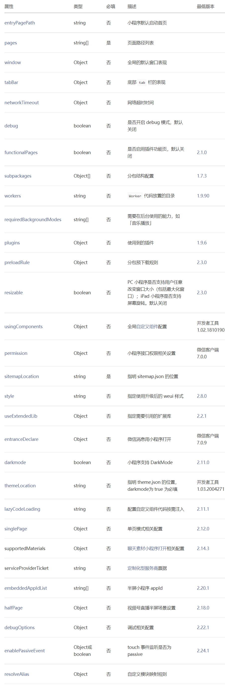
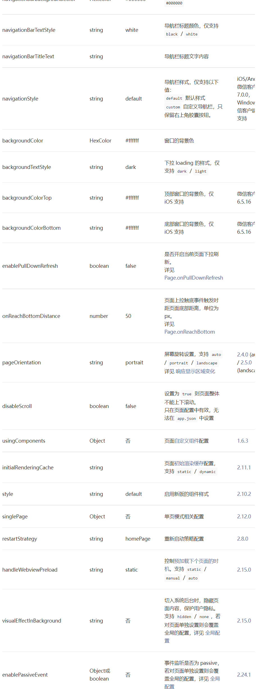

# 配置小程序

## 一、全局配置

小程序根目录下的 app.json 文件用来对微信小程序进行全局配置，决定页面文件的路径、窗口表现、设置网络超时时间、设置多 tab 等。

```json
以下是一个包含了部分常用配置选项的 app.json ：

{
  "pages": [
    "pages/index/index",
    "pages/logs/index"
  ],
  "window": {
    "navigationBarTitleText": "Demo"
  },
  "tabBar": {
    "list": [{
      "pagePath": "pages/index/index",
      "text": "首页"
    }, {
      "pagePath": "pages/logs/index",
      "text": "日志"
    }]
  },
  "networkTimeout": {
    "request": 10000,
    "downloadFile": 10000
  },
  "debug": true
}
```

`小程序根目录下的 app.json 文件用来对微信小程序进行全局配置。文件内容为一个 JSON 对象，有以下属性：`

### 1.1 **配置项：**



[详细信息：]

(https://developers.weixin.qq.com/miniprogram/dev/reference/configuration/app.html#%E5%85%A8%E5%B1%80%E9%85%8D%E7%BD%AE)

## 二、页面配置

每一个小程序页面也可以使用同名 .json 文件来对本页面的窗口表现进行配置，页面中配置项会覆盖 app.json 的 window 中相同的配置项。

例如：

```json
{
  "navigationBarBackgroundColor": "#ffffff",
  "navigationBarTextStyle": "black",
  "navigationBarTitleText": "微信接口功能演示",
  "backgroundColor": "#eeeeee",
  "backgroundTextStyle": "light"
}
```

app.json 中的部分配置，也支持对单个页面进行配置，可以在页面对应的 .json 文件来对本页面的表现进行配置。

页面中配置项在当前页面会覆盖 app.json 中相同的配置项（样式相关的配置项属于 app.json 中的 window 属性，但这里不需要额外指定 window 字段）

文件内容为一个 JSON 对象，有以下属性：

### 2.1 **配置项：**



- 注：并不是所有 app.js 中的配置都可以在页面覆盖或单独指定，仅限于本文档包含的选项。
- 注：iOS/Android 客户端 7.0.0 以下版本，`navigationStyle` 只在 app.json 中生效。

### 2.2 **配置示例**

```json
{
  "navigationBarBackgroundColor": "#ffffff",
  "navigationBarTextStyle": "black",
  "navigationBarTitleText": "微信接口功能演示",
  "backgroundColor": "#eeeeee",
  "backgroundTextStyle": "light"
}
```

## 三、sitemap 配置

微信现已开放小程序内搜索，开发者可以通过 `sitemap.json` 配置，或者管理后台页面收录开关来配置其小程序页面是否允许微信索引。当开发者允许微信索引时，微信会通过爬虫的形式，为小程序的页面内容建立索引。当用户的搜索词条触发该索引时，小程序的页面将可能展示在搜索结果中。 爬虫访问小程序内页面时，会携带特定的 user-agent：mpcrawler 及场景值：1129。需要注意的是，若小程序爬虫发现的页面数据和真实用户的呈现不一致，那么该页面将不会进入索引中。

具体配置说明

1. 页面收录设置：可对整个小程序的索引进行关闭，小程序管理后台 - 功能 - 页面内容接入 - 页面收录开关
2. sitemap 配置：可对特定页面的索引进行关闭

### 3.1 sitemap.json 配置

小程序根目录下的 sitemap.json 文件用来`配置小程序及其页面是否允许被微信索引`

- 例一：
  - 所有页面都会被微信索引（默认）

```json
{
  "rules": [
    {
      "action": "allow",
      "page": "*"
    }
  ]
}
```

- 例二：
  - 配置 path/to/page 页面不被索引，其余页面允许被索引

```json
{
  "rules": [
    {
      "action": "disallow",
      "page": "path/to/page"
    }
  ]
}
```

- 例三：
  - 配置 path/to/page 页面被索引，其余页面不被索引

```json
{
  "rules": [
    {
      "action": "allow",
      "page": "path/to/page"
    },
    {
      "action": "disallow",
      "page": "*"
    }
  ]
}
```

- 例四：
  - 包含 a 和 b 参数的 path/to/page 页面会被微信优先索引，其他页面都会被索引，例如：
    - path/to/page?a=1&b=2 => 优先被索引
    - path/to/page?a=1&b=2&c=3 => 优先被索引
    - path/to/page => 被索引
    - path/to/page?a=1 => 被索引
    - 其他页面都会被索引

```json
{
  "rules": [
    {
      "action": "allow",
      "page": "path/to/page",
      "params": ["a", "b"],
      "matching": "inclusive"
    },
    {
      "action": "allow",
      "page": "*"
    }
  ]
}
```

- 例五：
  - path/to/page?a=1&b=2 => 优先被索引
  - path/to/page?a=1&b=2&c=3 => 优先被索引
  - path/to/page => 不被索引
  - path/to/page?a=1 => 不被索引
  - 其他页面由于命中第二条规则，所以不会被索引
  - 由于优先级的问题，第三条规则是没有意义的

```json
{
  "rules": [
    {
      "action": "allow",
      "page": "path/to/page",
      "params": ["a", "b"],
      "matching": "inclusive"
    },
    {
      "action": "disallow",
      "page": "*"
    },
    {
      "action": "allow",
      "page": "*"
    }
  ]
}
```

**注：没有 sitemap.json 则默认所有页面都嫩恶搞被索引**

**注：{"action": "allow", "page": "\*"}是优先级最低的默认规则，未显式指明“disallow”的都默认被索引**

### 3.2 如何调试

当在小程序项目中设置了 sitemap 的配置文件（默认为 sitemap.json）时,便可在开发者工具控制台上显示当前页面是否被索引的调试信息（ 最新版本的开发者工具支持索引提示）


**1. 注：sitemap 的索引提示是默认开启的，如需要关闭 sitemap 的索引提示，可在小程序项目配置文件 project.config.json 的 setting 中配置字段 checkSiteMap 为 false**

**2. 注: sitemap 文件内容最大为 5120 个 UTF8 字符**
