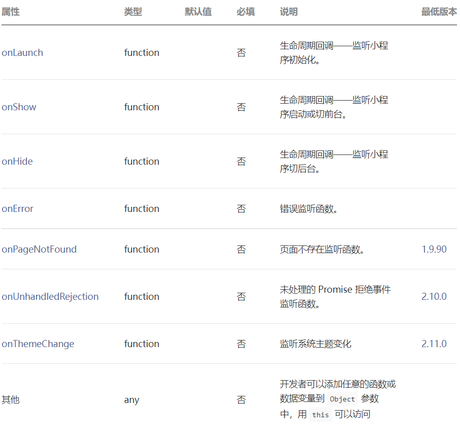
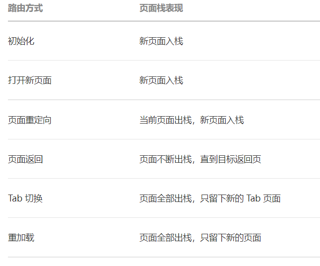
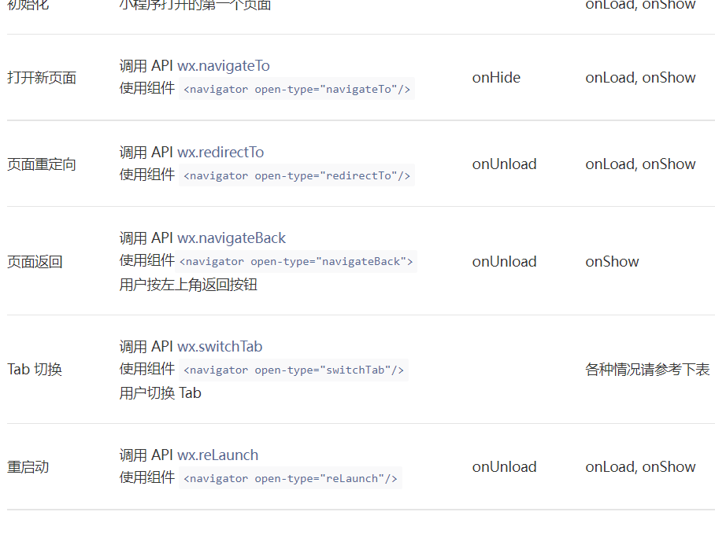
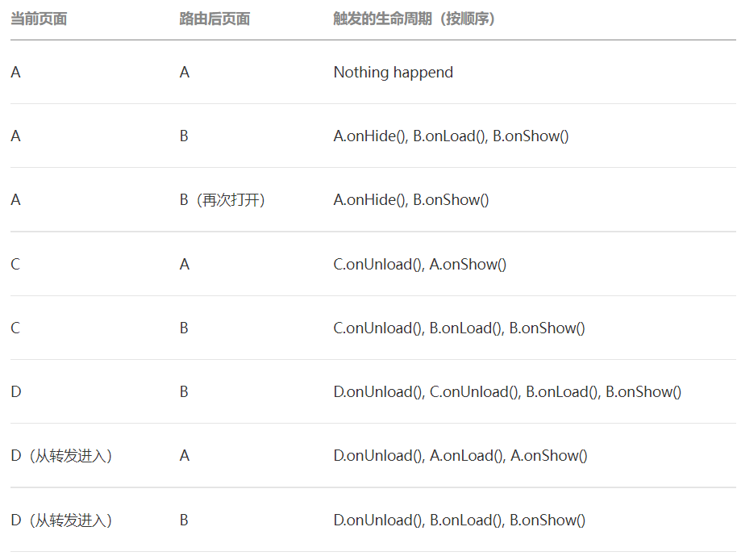

# 小程序框架

整个小程序框架系统分为两部分：`逻辑层（App Service）`和 `视图层（View）`。小程序提供了自己的视图层描述语言 WXML 和 WXSS，以及基于 JavaScript 的逻辑层框架，并在视图层与逻辑层间提供了数据传输和事件系统，让开发者能够专注于数据与逻辑。

### 1. 响应的数据绑定

框架的核心是一个响应的数据绑定系统，可以让数据与视图非常简单地保持同步。当做数据修改的时候，只需要在逻辑层修改数据，视图层就会做相应的更新。

通过这个简单的例子来看：

```xml
<!-- This is our View -->
<view> Hello {{name}}! </view>
<button bindtap="changeName"> Click me! </button>
```

```js
// This is our App Service.
// This is our data.
var helloData = {
  name: "Weixin",
};

// Register a Page.
Page({
  data: helloData,
  changeName: function (e) {
    // sent data change to view
    this.setData({
      name: "MINA",
    });
  },
});
```

- 开发者通过框架将逻辑层数据中的 name 与视图层的 name 进行了绑定，所以在页面一打开的时候会显示 Hello Weixin!；
- 当点击按钮的时候，视图层会发送 changeName 的事件给逻辑层，逻辑层找到并执行对应的事件处理函数；
- 回调函数触发后，逻辑层执行 setData 的操作，将 data 中的 name 从 Weixin 变为 MINA，因为该数据和视图层已经绑定了，从而视图层会自动改变为 Hello MINA!

### 2. 页面管理

框架 管理了整个小程序的页面路由，可以做到页面间的无缝切换，并给以页面完整的生命周期。开发者需要做的只是将页面的数据、方法、生命周期函数注册到 框架 中，其他的一切复杂的操作都交由 框架 处理。

### 3. 基础组件

框架 提供了一套基础的组件，这些组件自带微信风格的样式以及特殊的逻辑，开发者可以通过组合基础组件，创建出强大的微信小程序

### 4. 丰富的 API

框架 提供丰富的微信原生 API，可以方便的调起微信提供的能力，如获取用户信息，本地存储，支付功能等

## 一、 场景值

`场景值用来描述用户进入小程序的路径。`

由于 Android 系统限制，目前还无法获取到按 Home 键退出到桌面，然后从桌面再次进小程序的场景值，对于这种情况，会保留上一次的场景值。

**获取场景值**：

- 对于小程序，可以在 `App 的 onLaunch 和 onShow`，或 `wx.getLaunchOptionsSync` 中获取上述场景值。
- 对于小游戏，可以在 `wx.getLaunchOptionsSync` 和 `wx.onShow` 中获取上述场景值

**返回来源信息的场景**：

部分场景值下还可以获取来源应用、公众号或小程序的 appId。

| 场景值 | 场景                            | appid 含义 |
| ------ | ------------------------------- | ---------- |
| 1020   | 公众号 profile 页相关小程序列表 | 来源公众号 |
| 1035   | 公众号自定义菜单                | 来源公众号 |
| 1036   | APP 分享消息卡片                | 来源 APP   |
| 1037   | 小程序打开小程序                | 来源小程序 |
| 1038   | 从另一个小程序返回              | 来源小程序 |
| 1043   | 公众号模板消息                  | 来源公众号 |

## 二、逻辑层 APP Service

小程序开发框架的逻辑层使用 JavaScript 引擎为小程序提供开发者 JavaScript 代码的运行环境以及微信小程序的特有功能。

逻辑层将数据进行处理后发送给视图层，同时接受视图层的事件反馈。

开发者写的所有代码最终将会打包成一份 JavaScript 文件，并在小程序启动的时候运行，直到小程序销毁。这一行为类似 ServiceWorker，所以逻辑层也称之为 App Service。

在 JavaScript 的基础上，我们增加了一些功能，以方便小程序的开发：

- 增加 App 和 Page 方法，进行程序注册和页面注册。
- 增加 getApp 和 getCurrentPages 方法，分别用来获取 App 实例和当前页面栈。
- 提供丰富的 API，如微信用户数据，扫一扫，支付等微信特有能力。
- 提供模块化能力，每个页面有独立的作用域。

**注：小程序框架的逻辑层并非运行在浏览器中，因此，JavaScript 在 web 中一些能力都无法使用，如 window、document 等。**

### 2.1 注册小程序

每个小程序都需要在 app.js 中调用 App 方法注册小程序实例，绑定生命周期回调函数、错误监听和页面不存在监听函数等。

```js
// app.js
App({
  onLaunch(options) {
    // Do something initial when launch.
  },
  onShow(options) {
    // Do something when show.
  },
  onHide() {
    // Do something when hide.
  },
  onError(msg) {
    console.log(msg);
  },
  globalData: "I am global data",
});
```

`整个小程序只有一个 App 实例，是全部页面共享的`。开发者可以通过 `getApp` 方法获取到全局唯一的 App 实例，获取 App 上的数据或调用开发者注册在 App 上的函数。

```js
// xxx.js
const appInstance = getApp();
console.log(appInstance.globalData); // I am global data
```

详细的参数含义和使用请参考：

#### 2.1.1 APP(Object object)

注册小程序。接受一个 Object 参数，其指定小程序的生命周期回调等。

**App() 必须在 app.js 中调用，必须调用且只能调用一次。不然会出现无法预期的后果**

#### **参数**：

**`1. Object object`**



**`2. onLaunch(Object object)`**

**小程序初始化完成时触发，全局只触发一次**。参数也可以使用 wx.getLaunchOptionsSync 获取。

参数：与 wx.getLaunchOptionsSync 一致

**`3. onShow(Object object)`**

**小程序启动，或从后台进入前台显示时触发**。也可以使用 wx.onAppShow 绑定监听。

参数：与 wx.onAppShow 一致

**`4. onHide()`**

**小程序从前台进入后台时触发**。也可以使用 wx.onAppHide 绑定监听

**`5. onError(String error)`**

**小程序发生脚本错误或 API 调用报错时触发**。也可以使用 wx.onError 绑定监听。

参数：与 wx.onError 一致

**`6. onPageNotFound(Object object)`**

基础库 1.9.90 开始支持，低版本需做兼容处理。

**小程序要打开的页面不存在时触发**。也可以使用 wx.onPageNotFound 绑定监听。注意事项请参考 wx.onPageNotFound。

参数：与 wx.onPageNotFound 一致

示例代码：

```js
App({
  onPageNotFound(res) {
    wx.redirectTo({
      url: "pages/...",
    }); // 如果是 tabbar 页面，请使用 wx.switchTab
  },
});
```

**`7. onUnhandledRejection(Object object)`**

基础库 2.10.0 开始支持，低版本需做兼容处理。

**小程序有未处理的 Promise 拒绝时触发**。也可以使用 wx.onUnhandledRejection 绑定监听。注意事项请参考 wx.onUnhandledRejection。

参数：与 wx.onUnhandledRejection 一致

**`8. onThemeChange(Object object)`**

基础库 2.11.0 开始支持，低版本需做兼容处理。

**系统切换主题时触发**。也可以使用 wx.onThemeChange 绑定监听。

参数：与 wx.onThemeChange 一致

示例代码：

```js
App({
  onLaunch(options) {
    // Do something initial when launch.
  },
  onShow(options) {
    // Do something when show.
  },
  onHide() {
    // Do something when hide.
  },
  onError(msg) {
    console.log(msg);
  },
  globalData: "I am global data",
});
```

### 2.2 注册页面

对于小程序中的每个页面，都需要在页面对应的 js 文件中进行注册，指定页面的初始数据、生命周期回调、事件处理函数等

#### 2.2.1 使用 Page 构造器注册页面

简单的页面可以使用 `Page()` 进行构造。

示例代码：

```js
//index.js
Page({
  data: {
    text: "This is page data.",
  },
  onLoad: function (options) {
    // 页面创建时执行
  },
  onShow: function () {
    // 页面出现在前台时执行
  },
  onReady: function () {
    // 页面首次渲染完毕时执行
  },
  onHide: function () {
    // 页面从前台变为后台时执行
  },
  onUnload: function () {
    // 页面销毁时执行
  },
  onPullDownRefresh: function () {
    // 触发下拉刷新时执行
  },
  onReachBottom: function () {
    // 页面触底时执行
  },
  onShareAppMessage: function () {
    // 页面被用户分享时执行
  },
  onPageScroll: function () {
    // 页面滚动时执行
  },
  onResize: function () {
    // 页面尺寸变化时执行
  },
  onTabItemTap(item) {
    // tab 点击时执行
    console.log(item.index);
    console.log(item.pagePath);
    console.log(item.text);
  },
  // 事件响应函数
  viewTap: function () {
    this.setData(
      {
        text: "Set some data for updating view.",
      },
      function () {
        // this is setData callback
      }
    );
  },
  // 自由数据
  customData: {
    hi: "MINA",
  },
});
```

详细的参数含义和使用请参考:

(https://developers.weixin.qq.com/miniprogram/dev/reference/api/Page.html)

#### 2.2.2 在页面中使用 behaviors

基础库 2.9.2 开始支持，低版本需做兼容处理。

`页面可以引用 behaviors 。 behaviors 可以用来让多个页面有相同的数据字段和方法。`

```js
// my-behavior.js
module.exports = Behavior({
  data: {
    sharedText: "This is a piece of data shared between pages.",
  },
  methods: {
    sharedMethod: function () {
      this.data.sharedText === "This is a piece of data shared between pages.";
    },
  },
});
```

```js
// page-a.js
var myBehavior = require("./my-behavior.js");
Page({
  behaviors: [myBehavior],
  onLoad: function () {
    this.data.sharedText === "This is a piece of data shared between pages.";
  },
});
```

具体用法参见:

(https://developers.weixin.qq.com/miniprogram/dev/framework/custom-component/behaviors.html)

#### 2.2.3 使用 Component 构造器构造页面

基础库 1.6.3 开始支持，低版本需做兼容处理。

Page 构造器适用于简单的页面。但对于复杂的页面， Page 构造器可能并不好用。

此时，可以使用 Component 构造器来构造页面。 Component 构造器的主要区别是：`方法需要放在 methods: { } 里面`。

示例代码：

```js
Component({
  data: {
    text: "This is page data.",
  },
  methods: {
    onLoad: function (options) {
      // 页面创建时执行
    },
    onPullDownRefresh: function () {
      // 下拉刷新时执行
    },
    // 事件响应函数
    viewTap: function () {
      // ...
    },
  },
});
```

这种创建方式非常类似于 `自定义组件` ，可以像自定义组件一样使用 behaviors 等高级特性。

具体细节请阅读 Component 构造器 :

(https://developers.weixin.qq.com/miniprogram/dev/framework/custom-component/component.html)

### 2.3 页面路由

在小程序中所有页面的路由全部由框架进行管理。

#### 2.3.1 页面栈

框架以栈的形式维护了当前的所有页面。 当发生路由切换的时候，页面栈的表现如下：



开发者可以使用 `getCurrentPages()` 函数获取当前页面栈

#### 2.3.2 路由方式

对于路由的触发方式以及页面生命周期函数如下：



Tab 切换对应的生命周期（以 A、B 页面为 Tabbar 页面，C 是从 A 页面打开的页面，D 页面是从 C 页面打开的页面为例）：



**注意事项:**

- navigateTo, redirectTo 只能打开非 tabBar 页面。
- switchTab 只能打开 tabBar 页面。
- reLaunch 可以打开任意页面。
- 页面底部的 tabBar 由页面决定，即只要是定义为 tabBar 的页面，底部都有 tabBar。
- 调用页面路由带的参数可以在目标页面的 onLoad 中获取。

### 2.4 模块化

可以将一些公共的代码抽离成为一个单独的 js 文件，作为一个模块。模块只有通过 `module.exports` 或者 `exports` 才能对外暴露接口。

注意：

- exports 是 module.exports 的一个引用，因此在模块里边随意更改 exports 的指向会造成未知的错误。所以更`推荐开发者采用 module.exports 来暴露模块接口`，除非你已经清晰知道这两者的关系。

- 小程序目前不支持直接引入 node_modules , 开发者需要使用到 node_modules 时候建议拷贝出相关的代码到小程序的目录中，或者使用小程序支持的 npm 功能。

```js
// common.js
function sayHello(name) {
  console.log(`Hello ${name} !`);
}
function sayGoodbye(name) {
  console.log(`Goodbye ${name} !`);
}

module.exports.sayHello = sayHello;
exports.sayGoodbye = sayGoodbye;
```

​ 在需要使用这些模块的文件中，使用 require 将公共代码引入

```js
var common = require("common.js");
Page({
  helloMINA: function () {
    common.sayHello("MINA");
  },
  goodbyeMINA: function () {
    common.sayGoodbye("MINA");
  },
});
```

#### 2.4.1 文件作用域

在 JavaScript 文件中声明的变量和函数只在该文件中有效；不同的文件中可以声明相同名字的变量和函数，不会互相影响。

通过全局函数 getApp 可以获取全局的应用实例，如果需要全局的数据可以在 App() 中设置，如：

```js
// app.js
App({
  globalData: 1,
});
```

```js
// a.js
// The localValue can only be used in file a.js.
var localValue = "a";
// Get the app instance.
var app = getApp();
// Get the global data and change it.
app.globalData++;
```

```js
// b.js
// You can redefine localValue in file b.js, without interference with the localValue in a.js.
var localValue = "b";
// If a.js it run before b.js, now the globalData shoule be 2.
console.log(getApp().globalData);
```

### 2.5 API

小程序开发框架提供丰富的微信原生 API，可以方便的调起微信提供的能力，如获取用户信息，本地存储，支付功能等。详细介绍请参考 API 文档。

(https://developers.weixin.qq.com/miniprogram/dev/api/)

通常，在小程序 API 有以下几种类型：

#### 2.5.1 事件监听 API

`以 on 开头的 API 用来监听某个事件是否触发`，如：wx.onSocketOpen，wx.onCompassChange 等。

这类 API 接受一个回调函数作为参数，当事件触发时会调用这个回调函数，并将相关数据以参数形式传入。

```js
wx.onCompassChange(function (res) {
  console.log(res.direction);
});
```

#### 2.5.2 同步 API

`以 Sync 结尾的 API 都是同步 API`， 如 wx.setStorageSync，wx.getSystemInfoSync 等。此外，也有一些其他的同步 API，如 wx.createWorker，wx.getBackgroundAudioManager 等，详情参见 API 文档中的说明。

同步 API 的执行结果可以通过函数返回值直接获取，如果执行出错会抛出异常。

```js
try {
  wx.setStorageSync("key", "value");
} catch (e) {
  console.error(e);
}
```

#### 2.5.3 异步 API

大多数 API 都是异步 API，如 wx.request，wx.login 等。这类 API 接口`通常都接受一个 Object 类型的参数`，这个参数都支持按需指定以下字段来接收接口调用结果：

**Object 参数说明**

| 参数名   | 类型     | 必填 | 说明                                             |
| -------- | -------- | ---- | ------------------------------------------------ |
| success  | function | 否   | 接口调用成功的回调函数                           |
| fail     | function | 否   | 接口调用失败的回调函数                           |
| complete | function | 否   | 接口调用结束的回调函数（调用成功、失败都会执行） |
| 其他     | Any      | -    | 接口定义的其他参数                               |

**回调函数的参数**

`success，fail，complete` 函数调用时会传入一个 Object 类型参数，包含以下字段：

| 属性    | 类型   | 说明                                                             |
| ------- | ------ | ---------------------------------------------------------------- |
| errMsg  | string | 错误信息，如果调用成功返回 ${apiName}:ok                         |
| errCode | number | 错误码，仅部分 API 支持，具体含义请参考对应 API 文档，成功时为 0 |
| 其他    | Any    | 接口返回的其他数据                                               |

`异步 API 的执行结果需要通过 Object 类型的参数中传入的对应回调函数获取`。部分异步 API 也会有返回值，可以用来实现更丰富的功能，如 wx.request，wx.connectSocket 等。

```js
wx.login({
  success(res) {
    console.log(res.code);
  },
});
```

#### 2.5.4 异步 API 返回 Promise

基础库 2.10.2 版本起，异步 API 支持 callback & promise 两种调用方式。

当接口参数 Object 对象中不包含 success/fail/complete 时将默认返回 promise，否则仍按回调方式执行，无返回值。

**注意事项**

1. 部分接口如 downloadFile, request, uploadFile, connectSocket, createCamera（小游戏）本身就有返回值， 它们的 promisify 需要开发者自行封装。
2. 当没有回调参数时，异步接口返回 promise。此时若函数调用失败进入 fail 逻辑， 会报错提示 Uncaught (in promise)，开发者可通过 catch 来进行捕获。
3. wx.onUnhandledRejection 可以监听未处理的 Promise 拒绝事件。

```js
// callback 形式调用
wx.chooseImage({
  success(res) {
    console.log("res:", res);
  },
});

// promise 形式调用
wx.chooseImage().then((res) => console.log("res: ", res));
```

#### 2.5.5 云开发 API

开通并使用微信云开发，即可使用云开发 API，在小程序端直接调用服务端的云函数。

```js
wx.cloud.callFunction({
  // 云函数名称
  name: "cloudFunc",
  // 传给云函数的参数
  data: {
    a: 1,
    b: 2,
  },
  success: function (res) {
    console.log(res.result); // 示例
  },
  fail: console.error,
});

// 此外，云函数同样支持 promise 形式调用
```

## 三、视图层

- 框架的视图层由 WXML 与 WXSS 编写，由组件来进行展示。

- 将逻辑层的数据反映成视图，同时将视图层的事件发送给逻辑层。

- WXML(WeiXin Markup language) 用于描述页面的结构。

- WXS(WeiXin Script) 是小程序的一套脚本语言，结合 WXML，可以构建出页面的结构。

- WXSS(WeiXin Style Sheet) 用于描述页面的样式。

- 组件(Component)是视图的基本组成单元。

### 3.1 WXML

WXML（WeiXin Markup Language）是框架设计的一套标签语言，结合基础组件、事件系统，可以构建出页面的结构。

用以下一些简单的例子来看看 WXML 具有什么能力

#### 3.1.1 数据绑定

```xml
<!--wxml-->
<view> {{message}} </view>
```

```js
// page.js
Page({
  data: {
    message: "Hello MINA!",
  },
});
```

(https://developers.weixin.qq.com/miniprogram/dev/reference/wxml/data.html)

#### 3.1.2 列表渲染

```xml
<!--wxml-->
<view wx:for="{{array}}"> {{item}} </view>
```

```js
// page.js
Page({
  data: {
    array: [1, 2, 3, 4, 5],
  },
});
```

(https://developers.weixin.qq.com/miniprogram/dev/reference/wxml/list.html)

#### 3.1.3 条件渲染

```xml
<!--wxml-->
<view wx:if="{{view == 'WEBVIEW'}}"> WEBVIEW </view>
<view wx:elif="{{view == 'APP'}}"> APP </view>
<view wx:else="{{view == 'MINA'}}"> MINA </view>
```

```js
// page.js
Page({
  data: {
    view: "MINA",
  },
});
```

(https://developers.weixin.qq.com/miniprogram/dev/reference/wxml/conditional.html)

#### 3.1.4 模板

```xml
<!--wxml-->
<template name="staffName">
  <view>
    FirstName: {{firstName}}, LastName: {{lastName}}
  </view>
</template>

<template is="staffName" data="{{...staffA}}"></template>
<template is="staffName" data="{{...staffB}}"></template>
<template is="staffName" data="{{...staffC}}"></template>
```

```js
// page.js
Page({
  data: {
    staffA: { firstName: "Hulk", lastName: "Hu" },
    staffB: { firstName: "Shang", lastName: "You" },
    staffC: { firstName: "Gideon", lastName: "Lin" },
  },
});
```

(https://developers.weixin.qq.com/miniprogram/dev/reference/wxml/template.html)

#### 3.1.5 引用

(https://developers.weixin.qq.com/miniprogram/dev/reference/wxml/import.html)

### 3.2 WXSS

WXSS (WeiXin Style Sheets)是一套样式语言，用于描述 WXML 的组件样式。

WXSS 用来决定 WXML 的组件应该怎么显示。

为了适应广大的前端开发者，WXSS 具有 CSS 大部分特性。同时为了更适合开发微信小程序，WXSS 对 CSS 进行了扩充以及修改。

与 CSS 相比，WXSS 扩展的特性有：

- 尺寸单位
- 样式导入

#### 3.2.1 尺寸单位

`rpx`（responsive pixel）: `可以根据屏幕宽度进行自适应`。规定屏幕宽为 750rpx。如在 iPhone6 上，屏幕宽度为 375px，共有 750 个物理像素，则 750rpx = 375px = 750 物理像素，1rpx = 0.5px = 1 物理像素。

| 设备         | rpx 换算 px（屏幕宽度/750） | px 换算 rpx（750/屏幕宽度） |
| ------------ | --------------------------- | --------------------------- |
| iPhone5      | 1rpx = 0.42px               | 1px = 2.34rpx               |
| iPhone6      | 1rpx = 0.5px                | 1px = 2rpx                  |
| iPhone6 Plus | 1rpx = 0.552px              | 1px = 1.81rpx               |

**建议：** 开发微信小程序时设计师可以用 iPhone6 作为视觉稿的标准。

**注意：** 在较小的屏幕上不可避免的会有一些毛刺，请在开发时尽量避免这种情况。

#### 3.2.2 样式导入

使用 `@import` 语句可以导入外联样式表，@import 后跟需要导入的外联样式表的相对路径，用;表示语句结束。

```js
/** common.wxss **/
.small-p {
  padding: 5px;
}
```

```js
/** app.wxss **/
@import "common.wxss";
.middle-p {
  padding:15px;
}
```

#### 3.2.3 内联样式

框架组件上支持使用 style、class 属性来控制组件的样式。

- `style：`静态的样式统一写到 class 中。`style 接收动态的样式，在运行时会进行解析`，请尽量避免将静态的样式写进 style 中，以免影响渲染速度。

```js
<view style="color:{{color}};" />
```

- `class：`用于指定样式规则，其属性值是样式规则中类选择器名(样式类名)的集合，样式类名不需要带上.，样式类名之间用空格分隔。

```js
<view class="normal_view" />
```

#### 3.2.4 选择器

目前支持的选择器有：

| 选择器           | 样例           | 样例描述                                       |
| ---------------- | -------------- | ---------------------------------------------- |
| .class           | .intro         | 选择所有拥有 class="intro"的组件               |
| #id              | #firstname     | 选择拥有 id="firstname" 的组件                 |
| element          | view           | 选择所有 view 组件                             |
| element, element | view, checkbox | 选择所有文档的 view 组件和所有的 checkbox 组件 |
| ::after          | view::after    | 在 view 组件后边插入内容                       |
| ::before         | view::before   | 在 view 组件前边插入内容                       |

#### 3.2.5 全局样式与局部样式

定义在 app.wxss 中的样式为全局样式，作用于每一个页面。在 page 的 wxss 文件中定义的样式为局部样式，只作用在对应的页面，并会覆盖 app.wxss 中相同的选择器。
